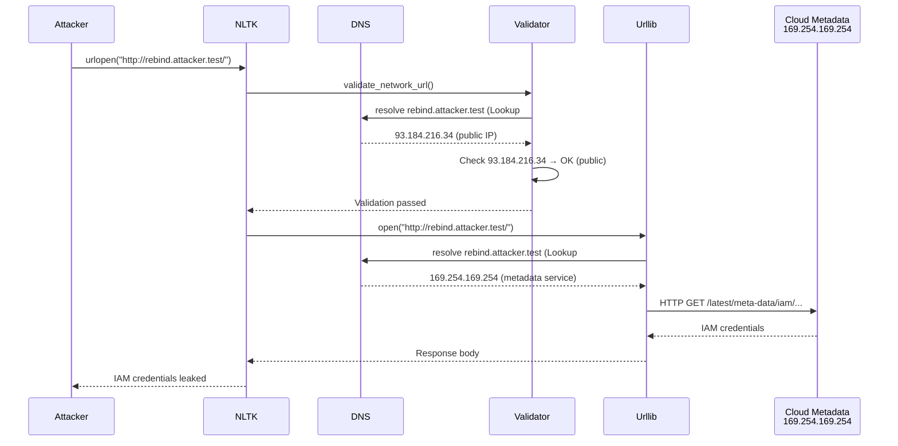

# NLTK DNS-Rebinding SSRF: No Direct Impact on SvelteKit


A high-severity DNS-rebinding vulnerability ([CVE-2026-12075](https://github.com/advisories/GHSA-qvv7-cg9c-w4x3)) has been disclosed in the Natural Language Toolkit (NLTK) Python library, affecting versions up to and including 3.9.4. The vulnerability allows attackers to bypass the `nltk.pathsec` Server-Side Request Forgery (SSRF) filter through DNS rebinding, enabling unauthorized access to internal services, cloud metadata endpoints, and potentially exposing IAM credentials.

**SvelteKit itself is not vulnerable.** SvelteKit is a JavaScript framework for building web applications and does not depend on NLTK. However, full-stack applications that combine a SvelteKit frontend with Python-based data processing, content analysis, or natural language processing pipelines may be indirectly exposed if those backend services use vulnerable NLTK versions. This advisory provides SvelteKit maintainers with the context needed to assess whether any Python dependencies in their broader application ecosystem require remediation.

## Table of Contents

- [Vulnerability Overview](#vulnerability-overview)
- [SvelteKit Applicability Assessment](#sveltekit-applicability-assessment)
- [Technical Details of the DNS-Rebinding Attack](#technical-details-of-the-dns-rebinding-attack)
- [Affected Versions and Severity](#affected-versions-and-severity)
- [Dependency Chain Analysis](#dependency-chain-analysis)
- [Verification and Detection](#verification-and-detection)
- [Remediation Actions](#remediation-actions)
- [Incident Response Checklist](#incident-response-checklist)
- [Evidence, Assumptions, and Limitations](#evidence-assumptions-and-limitations)
- [Sources](#sources)
- [FAQ](#faq)

---

## Vulnerability Overview

CVE-2026-12075 is a Server-Side Request Forgery (SSRF) vulnerability in the Natural Language Toolkit (NLTK), a widely-used Python library for natural language processing. The flaw exists in the `nltk.pathsec` module, which provides an SSRF filter intended to block requests to loopback, private, link-local, and multicast IP ranges.

The vulnerability arises because `nltk.pathsec.urlopen()` performs DNS resolution twice in independent code paths:

1. **Validation phase**: `validate_network_url()` resolves the hostname and checks the resulting IP address against a blocklist.
2. **Connection phase**: The underlying `urllib` library re-resolves the same hostname when establishing the HTTP connection.

An attacker controlling DNS for a hostname can return a public (allowed) IP during validation and an internal (blocked) IP during connection—a technique known as DNS rebinding. This bypasses the SSRF filter even when `nltk.pathsec.ENFORCE = True` is set, the strict mode recommended by NLTK documentation for security-sensitive environments.

> [!WARNING]
> The vulnerability enables **non-blind SSRF** with full response body access. Attackers can read responses from cloud instance metadata services (e.g., AWS EC2 metadata at `169.254.169.254`), potentially exposing IAM credentials and leading to cloud account compromise.

---

## SvelteKit Applicability Assessment

### Direct Impact: None

SvelteKit is a JavaScript/TypeScript framework that runs on Node.js or edge runtimes (Cloudflare Workers, Vercel Edge Functions, etc.). It has no runtime dependency on Python or NLTK. The [SvelteKit repository](https://github.com/sveltejs/kit) contains no references to NLTK, and the framework's core functionality—routing, server-side rendering, API endpoints, static generation—operates entirely within the JavaScript ecosystem.

**Conclusion**: SvelteKit applications are not directly vulnerable to CVE-2026-12075.

### Indirect Impact: Possible Through Backend Services

Many production web applications use SvelteKit for the frontend and user-facing API layer while delegating specialized processing to backend microservices. Common scenarios where NLTK might appear in the dependency chain include:

- **Content moderation pipelines**: Python services using NLTK for sentiment analysis, toxicity detection, or keyword extraction.
- **Search indexing**: NLP preprocessing of user-generated content before indexing.
- **Data ingestion**: ETL jobs that download and analyze text corpora using `nltk.download()` or `nltk.data.load()`.
- **Chatbot or recommendation engines**: Python-based ML services that process natural language.

If a SvelteKit application accepts user-controlled URLs or hostnames and passes them to a Python backend that uses `nltk.pathsec.urlopen()`, the SSRF vulnerability could be triggered indirectly.

> [!NOTE]
> **Dependency-chain relevance**: This vulnerability is relevant to SvelteKit teams only if their application architecture includes Python services that use NLTK 3.9.4 or earlier and accept URLs from untrusted sources.


---

## Technical Details of the DNS-Rebinding Attack

### How the Bypass Works

The `nltk.pathsec` module implements an SSRF filter in `validate_network_url()`, which:

1. Calls `_resolve_hostname(parsed.hostname)` to perform DNS resolution.
2. Checks each returned IP address against blocklists for:
   - Loopback addresses (`127.0.0.0/8`, `::1`)
   - Private ranges (`10.0.0.0/8`, `172.16.0.0/12`, `192.168.0.0/16`)
   - Link-local (`169.254.0.0/16`, `fe80::/10`)
   - Multicast ranges
3. Raises `PermissionError` if a blocked IP is found and `ENFORCE` mode is enabled.

However, after validation passes, `urlopen()` hands the original URL (with the raw hostname) to `urllib.request.build_opener().open(url)`. Deep in the connection layer, `urllib` performs a second, independent DNS lookup via `socket.getaddrinfo()`. This second lookup does not consult the validation cache or the filter logic.

**Attack flow:**



### Why the Cache Does Not Help

The `_resolve_hostname()` function is decorated with `@functools.lru_cache(maxsize=128)`, and its docstring states:

> "To help mitigate DNS rebinding attacks, the result is cached."

This is a **false assurance**. The cache only memoizes the validation-side lookup. The connection-side resolution in `socket.getaddrinfo()` is performed by the operating system and does not consult Python's `lru_cache`. An attacker can serve different IPs for each independent lookup, defeating the filter.

---

## Affected Versions and Severity

### Severity Box

| Attribute | Value |
|-----------|-------|
| **CVE ID** | [CVE-2026-12075](https://github.com/advisories/GHSA-qvv7-cg9c-w4x3) |
| **GHSA ID** | GHSA-qvv7-cg9c-w4x3 |
| **Severity** | **High** |
| **CVSS Score** | Not yet assigned (as of 2026-08-03) |
| **Affected Package** | `nltk` (Python package) |
| **Ecosystem** | PyPI (pip) |
| **Vulnerable Versions** | ≤ 3.9.4 |
| **Patched Version** | 3.10.0 |
| **Published** | 2026-07-31 |

### Version Range Table

| NLTK Version | Status | Notes |
|--------------|--------|-------|
| ≤ 3.9.4 | **Vulnerable** | DNS-rebinding SSRF bypass in `nltk.pathsec.urlopen()` |
| 3.10.0 | **Patched** | Fix applied; upgrade recommended |
| Future releases | Patched | Incorporate the fix from 3.10.0 |

> [!TIP]
> **SvelteKit maintainers**: If you do not use Python or NLTK anywhere in your application stack, no action is required. This advisory is informational only.

---

## Dependency Chain Analysis

SvelteKit's direct dependencies (as of release [@sveltejs/kit@2.70.2](https://github.com/sveltejs/kit/releases/tag/%40sveltejs/kit%402.70.2) on 2026-07-29) are exclusively JavaScript/TypeScript packages managed via npm. The framework does not invoke Python interpreters or pip-installed packages at build time or runtime.

### Where NLTK Might Appear in a SvelteKit Project

| Scenario | Example | Risk |
|----------|---------|------|
| **Monorepo with Python backend** | `/apps/web` (SvelteKit) + `/services/nlp` (Python/NLTK) | High if NLP service accepts user URLs |
| **CI/CD data preprocessing** | GitHub Actions workflow that runs `nltk.download()` to fetch corpora | Moderate if CI pulls from untrusted mirrors |
| **Serverless functions** | AWS Lambda (Python) invoked by SvelteKit API route | High if Lambda uses NLTK and processes user input |
| **Development tooling** | Contributor's local environment running Python scripts | Low (local exploitation only) |
| **No Python anywhere** | Pure JavaScript stack | **None** |

---

## Verification and Detection

### Checking for NLTK in Your Environment

If you use Python anywhere in your application stack, check for NLTK installations:

**In a Python virtual environment or container:**

```bash
# Check if nltk is installed and print its version
pip show nltk

# Alternative: use pip list
pip list | grep nltk
```

Expected output if vulnerable:

```
Name: nltk
Version: 3.9.4
Summary: Natural Language Toolkit
...
```

**In a requirements.txt or pyproject.toml file:**

```bash
# Search for nltk in Python dependency manifests
grep -r "nltk" requirements.txt pyproject.toml setup.py
```

**In containerized services:**

```bash
# Exec into a running container
docker exec -it <container-name> pip show nltk

# Or inspect the image layers
docker run --rm <image-name> pip list | grep nltk
```

> [!NOTE]
> These commands are provided as **generic examples only**. Always validate commands against your specific environment and deployment pipeline.

### Scanning for Vulnerable Code Patterns

If NLTK is present, search for usage of the vulnerable functions:

```bash
# Search Python source files for pathsec.urlopen usage
grep -r "pathsec.urlopen\|nltk.download\|nltk.data.load" --include="*.py" .
```

Vulnerable patterns include:

- `nltk.pathsec.urlopen(user_controlled_url)`
- `nltk.download(url=user_input)`
- `nltk.data.load(url=external_source, format="raw")`

If user-controlled input reaches any of these functions, the application is potentially exploitable.

---

## Remediation Actions

### For Applications Using NLTK

1. **Upgrade to NLTK 3.10.0 or later** as soon as possible:

   ```bash
   pip install --upgrade nltk
   ```

   Or in `requirements.txt`:

   ```
   nltk>=3.10.0
   ```

2. **Review all code paths** where `nltk.pathsec.urlopen()`, `nltk.download()`, or `nltk.data.load()` accept URLs:

   - Audit whether URLs come from untrusted sources (user input, external APIs, configuration files editable by users).
   - Apply **defense-in-depth**: use allowlists of trusted hostnames rather than relying solely on blocklists.

3. **Enable network-layer controls**:

   - Deploy backend services in private subnets with no direct internet access.
   - Use VPC endpoints or PrivateLink for cloud services.
   - Configure egress firewall rules to block access to `169.254.0.0/16` (AWS/GCP metadata), `fd00:ec2::254` (IPv6 metadata), and internal IP ranges from application workloads.

4. **Review IAM permissions**: Ensure services using NLTK run with minimal IAM roles. Avoid attaching roles that grant broad permissions if the service is exposed to user input.

### For SvelteKit-Only Projects

If your SvelteKit application does not use Python:

- **No action required** for this specific vulnerability.
- **Monitor your full stack**: Document the technology boundaries of your application (frontend, API, background workers, CI/CD) to quickly assess future advisories.
- **Consider a dependency audit**: Periodically review the dependency trees of all services in your deployment, not just the SvelteKit monorepo.

> [!WARNING]
> **Do not assume safety by name alone.** Even if your SvelteKit project has no Python code, third-party services, CI runners, or infrastructure-as-code templates might install NLTK. Audit your full deployment pipeline.

---

## Incident Response Checklist

Use this checklist if you determine that a vulnerable NLTK version is present in your environment:

- [ ] **Identify all services** that install `nltk<=3.9.4` (search container images, VM snapshots, CI logs, Lambda layers).
- [ ] **Determine exposure**: Does any service accept URLs or hostnames from untrusted input? Trace data flows from user-facing endpoints to Python backends.
- [ ] **Review logs** for suspicious outbound connections to `169.254.169.254`, `127.0.0.1`, or internal IP ranges from services running NLTK.
- [ ] **Check cloud provider logs** (CloudTrail, GCP Audit Logs, Azure Activity Log) for unusual metadata service access or IAM credential usage.
- [ ] **Upgrade NLTK** to 3.10.0 in all affected services; redeploy and verify the new version.
- [ ] **Rotate credentials** if you suspect metadata service access or unauthorized IAM role assumption.
- [ ] **Harden network policies**: Block egress to metadata endpoints and private IP ranges at the firewall or security group level.
- [ ] **Document the incident**: Record which services were vulnerable, when the patch was deployed, and any indicators of compromise.
- [ ] **Test the fix**: After upgrading, verify that legitimate NLTK operations (e.g., `nltk.download()` from official mirrors) still work.

---

## Evidence, Assumptions, and Limitations

### Evidence Used

- **GitHub Security Advisory GHSA-qvv7-cg9c-w4x3** ([source](https://github.com/advisories/GHSA-qvv7-cg9c-w4x3)), published 2026-07-31, which describes the vulnerability, provides a proof-of-concept, and lists affected/patched versions.
- **SvelteKit repository metadata** from [github.com/sveltejs/kit](https://github.com/sveltejs/kit), confirming that SvelteKit is a JavaScript framework with no Python dependencies.
- **SvelteKit release @sveltejs/kit@2.70.2** ([source](https://github.com/sveltejs/kit/releases/tag/%40sveltejs/kit%402.70.2)) dated 2026-07-29, demonstrating active maintenance and unrelated patch content (quadratic backtracking fix in `Accept` header parsing).

### Assumptions

- We assume the advisory's technical description and proof-of-concept are accurate (they are published by the GitHub Security Advisory Database and follow standard disclosure practices).
- We assume that SvelteKit projects using Python backend services would manage those dependencies separately (via `requirements.txt`, Poetry, or Docker images), not within the SvelteKit npm workspace.

### Limitations

- This analysis cannot assess every possible SvelteKit deployment architecture. Custom integrations, proprietary build pipelines, or unconventional polyglot tooling may introduce NLTK into the dependency chain in ways not covered here.
- The absence of a CVSS score (as of 2026-08-03) means quantitative severity comparison is not yet available. The "High" severity rating is from the advisory's qualitative assessment.
- Verification commands are generic examples. They may require adjustment for containerized, serverless, or air-gapped environments.

---

## Sources

1. [SvelteKit canonical repository](https://github.com/sveltejs/kit)
2. [SvelteKit latest GitHub release](https://github.com/sveltejs/kit/releases/tag/%40sveltejs/kit%402.70.2)
3. [GitHub Security Advisory GHSA-qvv7-cg9c-w4x3](https://github.com/advisories/GHSA-qvv7-cg9c-w4x3)

Data retrieved: 2026-08-03.

---

## FAQ

### Is SvelteKit vulnerable to CVE-2026-12075?

No. SvelteKit is a JavaScript framework with no runtime or build-time dependency on Python or NLTK. The vulnerability affects only Python applications using the `nltk.pathsec` module.

### Should I upgrade my SvelteKit installation?

Upgrading SvelteKit will not remediate this vulnerability because SvelteKit does not use NLTK. If you use Python services alongside SvelteKit, upgrade NLTK in those services to version 3.10.0 or later.

### How do I know if my backend uses NLTK?

Run `pip show nltk` in any Python environment (virtual environments, containers, serverless function layers) used by your application. Search your codebase for `import nltk` or `from nltk` to identify usage. Check `requirements.txt`, `Pipfile`, `pyproject.toml`, and Dockerfile `pip install` commands.

### What is DNS rebinding and why does it bypass the NLTK filter?

DNS rebinding is a technique where an attacker-controlled DNS server returns different IP addresses for successive lookups of the same hostname. NLTK validates the hostname once, then re-resolves it independently during the HTTP connection. The attacker serves a public (allowed) IP for validation and an internal (blocked) IP for the actual connection, bypassing the SSRF filter.

### Can this vulnerability be exploited from a SvelteKit frontend?

Only indirectly. A SvelteKit frontend cannot directly trigger the vulnerability because it runs in the browser or Node.js, not Python. However, if the frontend sends user-controlled URLs to a Python backend API that uses NLTK, the backend could be exploited. The attack surface depends on your application's architecture.

### What cloud metadata endpoints are at risk?

Common targets include AWS EC2 metadata (`http://169.254.169.254/latest/meta-data/`), Google Cloud metadata (`http://metadata.google.internal/computeMetadata/v1/`), and Azure Instance Metadata Service (`http://169.254.169.254/metadata/instance`). These endpoints can expose IAM credentials, SSH keys, and instance configuration. If a vulnerable NLTK service is running on a cloud instance with an IAM role, an attacker can steal credentials via SSRF.

### How quickly should I apply the patch?

If you use NLTK in production and it processes URLs from untrusted sources, treat this as a **high-priority patch**. The advisory provides a working proof-of-concept, and the vulnerability enables credential theft from cloud metadata services. Upgrade to NLTK 3.10.0 within your next maintenance window, ideally within 7 days. If your NLTK usage is internal-only with no user input, the risk is lower but patching is still recommended.
