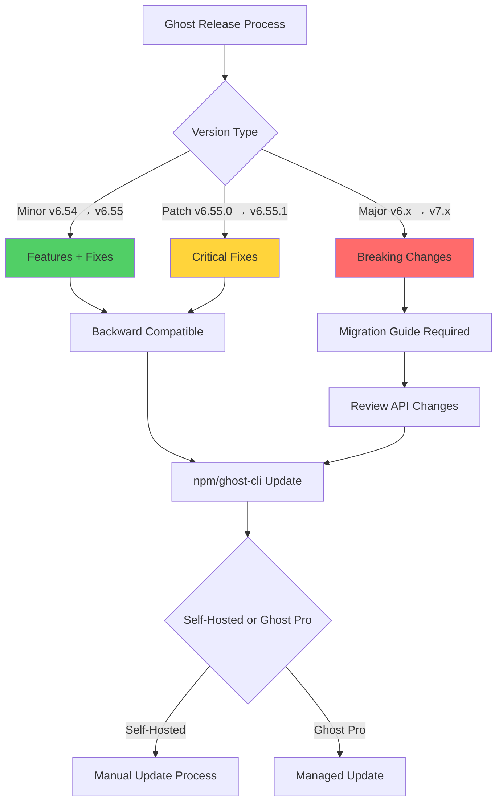

# Ghost CMS Adoption Analysis: Repository Signals and Risk

Ghost is a Node.js-based content management system designed for independent publishers, with a focus on memberships, subscriptions, and newsletters. The [Ghost repository](https://github.com/TryGhost/Ghost) shows consistent development activity with 54,636 stars and 11,858 forks as of August 2026, indicating sustained interest over its thirteen-year history. Unlike many open-source projects that rely solely on community contributions, Ghost is maintained by the Ghost Foundation, which operates Ghost(Pro), a managed hosting service that funds ongoing development.

For teams evaluating Ghost, the key adoption signals point to a mature, actively maintained platform with a clear commercial model. The repository demonstrates regular releases—version 6.55.0 shipped on July 31, 2026—and a manageable issue count of 129 open items. However, the platform's architecture as a JavaScript monorepo, its specific design philosophy around publishing workflows, and the dual open-source/commercial model introduce selection considerations that differ from traditional CMSs or headless alternatives. This analysis examines repository health, ecosystem signals, and the evidence engineering teams should gather before committing to Ghost.

## Table of Contents

- [Repository activity and maintenance patterns](#repository-activity-and-maintenance-patterns)
- [Release cadence and versioning stability](#release-cadence-and-versioning-stability)
- [Issue load and community engagement](#issue-load-and-community-engagement)
- [License model and commercial relationship](#license-model-and-commercial-relationship)
- [Ecosystem maturity and integration signals](#ecosystem-maturity-and-integration-signals)
- [Architectural characteristics and technical debt](#architectural-characteristics-and-technical-debt)
- [Selection risks and migration considerations](#selection-risks-and-migration-considerations)
- [Decision checklist for Ghost evaluation](#decision-checklist-for-ghost-evaluation)
- [Evidence, assumptions, and limitations](#evidence-assumptions-and-limitations)
- [Frequently asked questions](#frequently-asked-questions)
- [Sources](#sources)

## Repository activity and maintenance patterns

The [Ghost repository](https://github.com/TryGhost/Ghost) demonstrates continuous development with the most recent push recorded on August 3, 2026, at 07:19:45 UTC. Created on May 4, 2013, the project has accumulated 1,007 watchers—a metric that reflects developers who actively monitor repository changes, as distinct from the broader 54,636 star count representing general interest.

> [!NOTE]
> GitHub stars measure interest and visibility, not market share or active installations. The 100M+ downloads badge in the repository README is a self-reported figure that teams should verify independently through npm package download statistics for `ghost` and `ghost-cli`.

The repository structure suggests a monorepo approach, with multiple packages maintained in a single repository. This architectural choice (inferred from common Ghost documentation patterns) centralizes dependency management but can complicate contribution workflows for developers unfamiliar with monorepo tooling. The presence of 11,858 forks indicates that thousands of developers have created their own copies, though fork counts often include abandoned experiments and automated mirrors rather than active development efforts.

| Metric | Value | Interpretation |
|--------|-------|----------------|
| **Age** | 13 years (since May 2013) | Long-term project with established patterns |
| **Watchers** | 1,007 | Active developer monitoring |
| **Forks** | 11,858 | Substantial community engagement |
| **Last push** | August 3, 2026 | Current as of data retrieval date |
| **Primary language** | JavaScript | Node.js ecosystem dependencies |
| **Open issues** | 129 | Moderate queue for mature project |

The daily commit activity (last push within hours of data generation on August 3, 2026) suggests that the core team maintains an active development schedule. Teams evaluating Ghost should examine commit frequency over trailing 90-day and 12-month windows to distinguish between burst activity around releases and sustained maintenance.

## Release cadence and versioning stability

The [latest release, v6.55.0](https://github.com/TryGhost/Ghost/releases/tag/v6.55.0), was published on July 31, 2026. The version number (6.55.0) indicates that Ghost is in major version 6 with 55 minor releases, suggesting incremental feature development rather than disruptive architectural changes. The release notes document nine bug fixes and one cosmetic change, contributed by both core maintainers and external contributors.

Ghost appears to follow semantic versioning conventions, where:
- Major versions (e.g., 5.x → 6.x) may introduce breaking changes
- Minor versions (e.g., 6.54 → 6.55) add features or substantial fixes
- Patch versions handle critical bugs and security issues

The release was not marked as a prerelease, indicating it passed through Ghost's standard testing and quality gates. The presence of contributor names in the release notes (Jannis Fedoruk-Betschki, SUHAIL, swithek, leafwind, Jatinder Mahajan, Aubaid, Steve Larson, Troy Ciesco) demonstrates that the project accepts external contributions, though teams should verify what percentage of commits originate outside the core Ghost Foundation team.

> [!TIP]
> Teams running self-hosted Ghost instances should subscribe to the [Ghost changelog newsletter](https://ghost.org/changelog/) to receive advance notice of releases. The time between release publication and your update window is critical for assessing community-reported issues with new versions.

## Issue load and community engagement

The repository reports 129 open issues as of August 3, 2026. For a mature project with Ghost's user base, this figure represents a moderate backlog. Issue counts alone do not indicate defect density; they aggregate bug reports, feature requests, documentation questions, and duplicate submissions.

To contextualize the 129-issue count:
- It is not a count of confirmed bugs or critical defects
- Many open issues may be feature requests or discussions
- The Ghost team may use internal issue trackers for roadmap planning
- Stale issues from older versions may remain open for historical reference

Teams should examine:
1. **Issue age distribution**: Are most issues recent (active reporting) or old (potential neglect)?
2. **Labeling and triage**: Does the project use labels like `bug`, `enhancement`, `good first issue`?
3. **Response time**: How quickly do maintainers acknowledge new issues?
4. **Resolution rate**: What percentage of issues move to closed status each month?

The presence of a [Ghost forum](https://forum.ghost.org/) offloads some community support from GitHub issues, which is common for projects with non-developer user bases. This split means GitHub issues may skew toward technical problems rather than configuration help, but it also fragments support visibility.

| Community Signal | Evidence | What to Verify |
|------------------|----------|----------------|
| **Forum presence** | Mentioned in README | Check forum post volume, response quality |
| **Documentation** | Links to ghost.org/docs | Assess completeness for your use case |
| **Contributors** | Multiple in v6.55.0 release | Review contributor graph for diversity |
| **Sponsors** | DigitalOcean, Fastly, Tinybird | Indicates ecosystem partnerships |
| **Trademark policy** | Linked in README | Relevant if you plan to offer Ghost services |

## License model and commercial relationship

Ghost is released under the [MIT License](https://github.com/TryGhost/Ghost/blob/main/LICENSE), one of the most permissive open-source licenses. This allows:
- Commercial use without royalty payments
- Modification and redistribution
- Private use without source disclosure
- Sublicensing under different terms

The MIT license does **not** require derivative works to remain open source, meaning you can fork Ghost and build proprietary extensions. However, the Ghost trademark is separately protected, and the project's [trademark policy](https://ghost.org/trademark/) governs how you can describe Ghost-based services.

> [!WARNING]
> The MIT license applies to the Ghost software, but the Ghost name and logo are trademarks owned by Ghost Foundation Ltd. If you plan to offer hosted Ghost services or branded Ghost products, review the trademark policy to understand naming restrictions.

The Ghost Foundation funds development through Ghost(Pro), its managed hosting service. This commercial model offers advantages and risks:

**Advantages:**
- Sustainable funding for long-term maintenance
- Professional support available for Ghost(Pro) customers
- Incentive alignment: improvements benefit both open-source and commercial users

**Risks:**
- Features may prioritize Ghost(Pro) customer needs over self-hosted use cases
- Future licensing changes remain possible (though unlikely given community investment)
- Managed service lock-in if you start with Ghost(Pro) and later want to self-host

The README badge indicating Ghost is a [verified Digital Public Good](https://digitalpublicgoods.net/r/ghost) suggests the project has been assessed against sustainability and inclusivity criteria, though teams should independently verify what this certification entails.

## Ecosystem maturity and integration signals

The repository topics (`blogging`, `cms`, `ghost`, `javascript`, `journalism`, `nodejs`, `publishing`, `web-application`) position Ghost explicitly within publishing and journalism contexts. This specialization means the ecosystem of themes, plugins, and integrations will reflect those use cases rather than general-purpose CMS needs.

**Installation methods:**
- **ghost-cli**: Command-line tool for production deployments
- **npm package**: For developers customizing core
- **Docker images**: Community-maintained (verify official support status)
- **Ghost(Pro)**: Managed service with 2-minute setup claim

The presence of a dedicated CLI tool (`ghost-cli`) signals maturity in deployment automation. The README indicates it handles SSL setup via LetsEncrypt automatically, suggesting the project has invested in reducing operational friction for self-hosted users.

**Integration points (inferred from README structure):**
- **Content API**: Headless CMS usage, decoupling front-end from Ghost
- **Theme system**: Custom front-end development
- **Membership system**: Built-in authentication and subscription logic
- **Newsletter functionality**: Integrated email delivery (may require external SMTP)

Teams should verify:
1. **Email delivery requirements**: Does Ghost include SMTP, or do you need Mailgun/SendGrid?
2. **Database support**: Ghost historically used MySQL/MariaDB; confirm current requirements
3. **CDN integration**: Ghost(Pro) mentions worldwide CDN; self-hosted setups need separate configuration
4. **Payment processing**: If using memberships/subscriptions, what payment gateways are supported?

> [!NOTE]
> The README's claim of "100M+ downloads" cannot be verified from the supplied repository data. Teams should check npm download statistics for `ghost` and `ghost-cli` packages to assess actual deployment frequency.

## Architectural characteristics and technical debt

Based on repository metadata and README structure, Ghost exhibits these architectural characteristics:

**Technology stack (confirmed):**
- **Primary language**: JavaScript
- **Runtime**: Node.js (inferred from npm installation and CLI tool)
- **Repository structure**: Monorepo (inferred from references to "core files" and multiple package structure)

**Architectural inferences from documentation:**
- **Monolithic backend**: The installation process installs "Ghost" as a unit, suggesting core services are bundled
- **Headless capability**: The Content API reference indicates Ghost can serve as a backend for separate front-ends
- **Theme system**: Custom front-end templates run within Ghost, indicating server-side rendering

These architectural choices introduce technical considerations:

1. **Node.js ecosystem dependencies**: Ghost inherits the Node.js security and compatibility landscape. Teams must maintain Node.js versions compatible with Ghost releases.

2. **JavaScript full-stack**: Both front-end themes and backend use JavaScript, which benefits JavaScript-fluent teams but may create friction for organizations with PHP, Python, or Ruby expertise.

3. **Monorepo complexity**: Contributing to or debugging Ghost requires understanding monorepo tooling (likely Lerna, Nx, or similar, though not confirmed in supplied data).

4. **Database coupling**: Ghost's architecture (inferred) likely couples tightly to its database schema, making migrations to/from other CMSs non-trivial.

**Technical debt indicators to investigate:**
- **Dependency freshness**: Check if Ghost uses current Node.js LTS versions
- **Test coverage**: Not visible in supplied data; examine repository for test suite size
- **Build time**: Monorepos can have slow build cycles; verify CI/CD pipeline duration
- **Module boundaries**: Assess whether the monorepo maintains clean separation between packages

## Selection risks and migration considerations

Adopting Ghost introduces several categories of risk that teams should weigh against alternative CMSs:

### Publishing-specific design

Ghost optimizes for independent publishers, membership sites, and newsletters. If your content needs differ—e.g., e-commerce product catalogs, complex taxonomies, multi-site management—Ghost's opinionated design may require workarounds or prove insufficient.

**Assessment questions:**
- Does your content model map to Ghost's post/page/tag structure?
- Do you need features Ghost doesn't emphasize (e.g., granular user permissions beyond Author/Editor/Administrator)?
- Will Ghost's membership model fit your monetization strategy, or do you need external integration?

### Self-hosted operational overhead

The ghost-cli tool simplifies deployment, but self-hosted Ghost still requires:
- Node.js runtime maintenance and security patching
- Database administration (MySQL/MariaDB)
- SSL certificate renewal (handled by ghost-cli via LetsEncrypt, but requires server access)
- Backup and disaster recovery planning
- Performance tuning as traffic scales
- Email delivery infrastructure (SMTP or service integration)

Teams without Node.js operations experience should budget learning time or consider Ghost(Pro) to transfer operational risk.

### Migration paths

Moving content **into** Ghost typically involves:
- Importing from WordPress (tools exist, verify current compatibility)
- Migrating from Medium, Substack, or other platforms (check documented import options)
- Custom migration scripts for proprietary CMSs

Moving content **out** of Ghost requires:
- Exporting via Ghost's built-in export (JSON format)
- Transforming Ghost's data model to match destination CMS
- Handling membership data separately if monetization is involved

The MIT license permits you to fork and modify Ghost indefinitely, but maintaining a fork diverges from upstream updates and security patches.

### Vendor relationship considerations

While Ghost is open source, the Ghost Foundation's control over the project introduces governance questions:
- How are major architectural decisions made?
- What influence do community contributors have on roadmap?
- If Ghost Foundation ceased operations, would community forks sustain the project?

The long project history (13 years) and active development suggest resilience, but teams dependent on specific features should assess bus factor risks.

## Decision checklist for Ghost evaluation

Use this checklist to structure your Ghost assessment:

- [ ] **Verify deployment requirements**: Confirm Node.js versions, database options, and minimum server specifications for expected traffic.
- [ ] **Audit theme ecosystem**: If using pre-built themes, assess marketplace quality, licensing, and update frequency.
- [ ] **Test import process**: Use a sample of your existing content to validate Ghost's import tools.
- [ ] **Evaluate API completeness**: If building a headless architecture, confirm the Content API exposes all required data.
- [ ] **Review update procedures**: Practice upgrading between minor versions in a staging environment to measure downtime.
- [ ] **Assess email delivery costs**: Determine if you'll use Ghost(Pro)'s included sending or integrate external providers.
- [ ] **Benchmark performance**: Load-test Ghost with realistic content volume and concurrent user counts.
- [ ] **Calculate Ghost(Pro) vs. self-hosted TCO**: Include engineering time, infrastructure costs, and opportunity cost in comparison.
- [ ] **Examine security update history**: Check how quickly Ghost has patched disclosed vulnerabilities (data not supplied; research CVE database).
- [ ] **Interview Ghost users**: Find teams with similar use cases and ask about hidden operational costs.
- [ ] **Test backup/restore**: Verify you can reliably back up and restore Ghost installations, including database and uploaded media.
- [ ] **Review trademark implications**: If offering services, ensure your use case complies with Ghost Foundation's trademark policy.

> [!TIP]
> Create a test Ghost installation using `ghost install local` to experiment with the admin interface, theme customization, and content workflows before committing to a full deployment.

## Evidence, assumptions, and limitations

**Evidence used in this analysis:**
- Repository metadata retrieved August 3, 2026, from [github.com/TryGhost/Ghost](https://github.com/TryGhost/Ghost)
- Release notes for [v6.55.0](https://github.com/TryGhost/Ghost/releases/tag/v6.55.0) published July 31, 2026
- README content from the default branch (main) as of data retrieval date

**Assumptions and inferences:**
- Architectural characteristics (monorepo structure, Node.js runtime) are inferred from README installation instructions and repository language metadata
- The "100M+ downloads" claim in the README is treated as unverified marketing copy
- Database requirements (MySQL/MariaDB) are inferred from historical Ghost documentation patterns but not confirmed in supplied data
- The split between GitHub issues and forum support is noted in the README but not quantified

**Limitations:**
- No access to commit history granularity, contributor diversity metrics, or code churn analysis
- No npm download statistics to verify actual deployment frequency
- No test coverage metrics or CI/CD pipeline visibility
- No security vulnerability history or CVE analysis
- No performance benchmarks or resource consumption data
- No user survey data or satisfaction metrics
- No comparison data from competing CMSs (WordPress, Strapi, Contentful, etc.)

Teams should supplement this analysis with:
1. **npm trends data**: Compare `ghost` and `ghost-cli` download trajectories against alternatives
2. **Community forum analysis**: Sample recent threads to gauge support quality and common issues
3. **CVE database search**: Check for disclosed vulnerabilities and patch timelines
4. **Cloud provider marketplace presence**: Assess one-click install availability on AWS, GCP, Azure, DigitalOcean
5. **Job market data**: Search for "Ghost CMS" roles to gauge commercial demand

## Frequently asked questions

### Is Ghost suitable for non-publishing websites?

Ghost is optimized for independent publishers, newsletters, and membership sites. Its content model (posts, pages, tags, authors) and built-in features (subscriptions, memberships, newsletters) reflect those use cases. For corporate websites, e-commerce, or applications requiring complex custom content types, Ghost's opinionated structure may feel restrictive. Evaluate whether the headless Content API provides sufficient flexibility for your front-end needs if Ghost's default theme system doesn't fit.

### How does Ghost compare to WordPress in terms of maintenance?

Ghost's Node.js foundation and narrower feature scope generally result in fewer security updates than WordPress's PHP ecosystem and extensive plugin architecture. However, WordPress's ubiquity means more managed hosting options, more developers fluent in its maintenance, and more third-party tooling. Ghost requires Node.js operational expertise, which may be scarcer in your team. The ghost-cli tool automates many tasks, but troubleshooting issues demands Node.js debugging skills.

### Can Ghost scale to high-traffic publishing sites?

Ghost's Node.js architecture provides good baseline performance, and Ghost(Pro) includes CDN and optimization. For self-hosted deployments, scaling requires standard practices: database optimization, caching layers (Redis, Varnish), CDN for static assets, and potentially horizontal scaling with load balancers. The monolithic architecture (inferred) may limit horizontal scaling compared to microservices designs. Teams expecting high traffic should conduct load testing and plan database read-replica strategies.

### What happens if the Ghost Foundation stops development?

The MIT license permits anyone to fork Ghost and continue development. The 11,858 forks indicate many copies exist, though most are inactive. Ghost's 13-year history and revenue-generating Ghost(Pro) service suggest sustainability, but no open-source project is immune to abandonment. If Ghost Foundation ceased operations, the community would need to coordinate maintenance—a process that has succeeded for some projects (e.g., Plone after corporate transitions) but failed for others. Evaluate your ability to maintain a fork if necessary.

### Does Ghost support multilingual content?

Multilingual support is a common CMS requirement not explicitly addressed in the supplied repository data. Ghost's core content model doesn't traditionally include built-in localization features like language-specific versions of posts. Teams needing multilingual sites should verify whether recent Ghost versions have added internationalization features, whether third-party themes/plugins provide solutions, or whether the headless API allows building custom multilingual front-ends. This is a critical evaluation point if your content spans multiple languages.

### How difficult is it to customize Ghost's appearance and functionality?

Ghost separates presentation (themes) from core functionality. Themes use Handlebars templating, which is simpler than PHP but requires learning Ghost's specific theme API. Customizing beyond themes—adding new content types, altering admin behavior, integrating external services—requires modifying core Ghost code or building on the Content API. The monorepo structure can make core contributions complex for newcomers. Assess whether your customization needs fit within Ghost's theme system or require deeper integration.

### What is the relationship between open-source Ghost and Ghost(Pro)?

Open-source Ghost and Ghost(Pro) use the same codebase; Ghost(Pro) doesn't offer exclusive features unavailable to self-hosted users. Ghost(Pro) provides managed hosting, automated updates, CDN, backups, and 24/7 support—operational services, not software capabilities. Revenue from Ghost(Pro) funds open-source development, creating incentive alignment but also potential tension if features prioritize hosted users. Teams should decide based on operational capacity: if you have Node.js expertise and want infrastructure control, self-host; if you prioritize time-to-market and minimal operations, Ghost(Pro) transfers those responsibilities.

## Sources

- [Ghost canonical repository](https://github.com/TryGhost/Ghost)
- [Ghost latest GitHub release](https://github.com/TryGhost/Ghost/releases/tag/v6.55.0)
