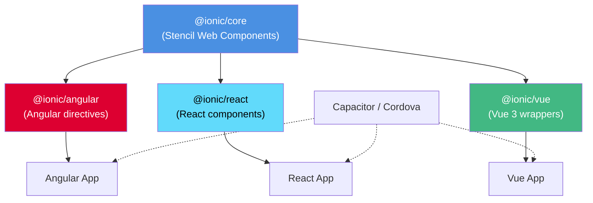

# Ionic Framework Architecture: Web Component Design Analysis

Ionic Framework employs a layered architecture that separates a Web Component core from framework-specific adapter packages, enabling developers to build cross-platform user interfaces from a single codebase. The [ionic-team/ionic-framework repository](https://github.com/ionic-team/ionic-framework) reveals a monorepo containing `@ionic/core`—a Web Component library compiled with [Stencil](https://stenciljs.com/)—alongside first-class integration packages for Angular, React, and Vue. This design decouples UI primitives from framework idioms, allowing each adapter to expose the same underlying components through native APIs: Angular directives, React functional components, and Vue wrappers. Released under the MIT license with 52,596 GitHub stars as of February 2026, the repository shows active maintenance with version 8.8.16 published on [July 29, 2026](https://github.com/ionic-team/ionic-framework/releases/tag/v8.8.16).

The architectural choice to use Web Components as the distribution format rather than framework-specific primitives has direct implications for bundle sizes, runtime performance, and upgrade paths. By compiling components to standards-compliant custom elements, Ionic achieves framework portability at the cost of increased abstraction and occasional interoperability friction with framework-specific tooling. This analysis examines the monorepo structure, component compilation pipeline, extension points for theming and customization, scaling boundaries for large applications, and the operational trade-offs inherent in supporting three major JavaScript frameworks from a single set of UI primitives.

---

## Table of Contents

- [Monorepo Structure and Package Boundaries](#monorepo-structure-and-package-boundaries)
- [Core: Web Component Foundation](#core-web-component-foundation)
- [Framework Adapters: Angular, React, and Vue](#framework-adapters-angular-react-and-vue)
- [Component Lifecycle and Rendering Pipeline](#component-lifecycle-and-rendering-pipeline)
- [Theming, Customization, and Extension Points](#theming-customization-and-extension-points)
- [Build, Release, and Distribution](#build-release-and-distribution)
- [Scaling Boundaries and Operational Constraints](#scaling-boundaries-and-operational-constraints)
- [Decision Checklist](#decision-checklist)
- [Evidence, Assumptions, and Limitations](#evidence-assumptions-and-limitations)
- [FAQ](#faq)
- [Sources](#sources)

---

## Monorepo Structure and Package Boundaries

The [ionic-framework repository](https://github.com/ionic-team/ionic-framework) organizes code into a monorepo with distinct packages for the core component library and framework integrations. Based on the README package table, the primary artifacts are:

| Package | NPM Name | Purpose | Inferred Dependencies |
|---------|----------|---------|----------------------|
| **Core** | `@ionic/core` | Web Component primitives compiled with Stencil | Stencil compiler, TypeScript |
| **Angular** | `@ionic/angular` | Angular directives wrapping Web Components | `@ionic/core`, Angular framework |
| **React** | `@ionic/react` | React functional components wrapping Web Components | `@ionic/core`, React, React DOM |
| **Vue** | `@ionic/vue` | Vue 3 wrappers for Web Components | `@ionic/core`, Vue 3 |

The repository topics list `stencil` and `stenciljs`, indicating that the core library is authored in Stencil's TypeScript-like syntax and compiled to vanilla JavaScript Web Components. This compilation step produces custom elements that Angular, React, and Vue adapters consume, creating a dependency graph where framework packages depend on `@ionic/core` but not on each other.

> [!NOTE]
> **Inferred from repository structure:** The monorepo likely uses a workspace manager such as Lerna, Nx, or npm/yarn workspaces to coordinate builds across packages. The README does not specify the tooling, but the presence of multiple packages in a single repository with synchronized versioning (e.g., v8.8.16 across all packages) suggests automated dependency management.

### Package Boundaries

The separation between core and adapters enforces a clear boundary: UI logic, styling, and interaction patterns reside in `@ionic/core`, while framework-specific concerns—lifecycle hooks, event binding, two-way data binding, and router integration—live in the adapter packages. This boundary allows Ionic to ship breaking changes to a framework adapter without recompiling the Web Components, though in practice major versions tend to update both layers simultaneously.

---

## Core: Web Component Foundation

`@ionic/core` serves as the single source of truth for component appearance, behavior, and accessibility. Each component—such as `<ion-button>`, `<ion-modal>`, or `<ion-datetime>`—is authored in Stencil, a compiler that generates standards-compliant custom elements with polyfills for older browsers. Stencil components use decorators (`@Component`, `@Prop`, `@State`, `@Event`, `@Method`) to define public APIs, internal state, and DOM events.

### Component Authoring Example (Inferred)

While the repository does not expose raw Stencil source in the README, typical Ionic component architecture includes:

- **Props**: Attributes that control component configuration (e.g., `color`, `size`, `disabled`).
- **State**: Internal reactive variables managed by Stencil's runtime.
- **Events**: Custom DOM events emitted via `EventEmitter` (e.g., `ionChange`, `ionFocus`).
- **Methods**: Public JavaScript methods exposed on the custom element (e.g., `open()`, `dismiss()`).
- **Shadow DOM**: Many components use shadow DOM for style encapsulation, though some use light DOM for easier global styling.

> [!TIP]
> **Operational insight:** Because Ionic components are Web Components, they can be instantiated imperatively via JavaScript (`document.createElement('ion-modal')`) or declaratively in HTML. This dual-mode usage is critical for framework adapters, which often need to create components programmatically (e.g., opening a modal via a service call).

### Platform Detection and Adaptive Styling

The core library includes platform detection logic to apply iOS, Material Design (Android), or generic styles based on the runtime environment. This detection infers the platform from user agent strings or URL parameters, allowing a single codebase to render platform-appropriate UIs without conditional imports. The repository topics list both `ios` and `material-design`, confirming that design system variants are baked into the core rather than distributed as separate packages.

---

## Framework Adapters: Angular, React, and Vue

Each adapter package translates Web Component semantics into framework-native patterns. The implementation strategies differ due to framework-specific constraints:

### Angular Adapter

`@ionic/angular` provides Angular directives that wrap each Web Component. Key responsibilities include:

- **NgModule declarations**: Registering directives for each Ionic component.
- **Router integration**: Synchronizing `<ion-router-outlet>` with Angular's router, including lifecycle guards and animation transitions.
- **Form integration**: Implementing `ControlValueAccessor` for components like `<ion-input>`, `<ion-checkbox>`, and `<ion-toggle>` to support Angular's reactive and template-driven forms.
- **Zone.js compatibility**: Ensuring change detection triggers when Web Component events fire.

The [latest release notes](https://github.com/ionic-team/ionic-framework/releases/tag/v8.8.16) mention a bug fix for Angular: "guard transition against destroyed router outlet," indicating that the adapter must handle edge cases where Angular's router destroys outlets mid-transition.

### React Adapter

`@ionic/react` exports functional components that render Web Components and attach React event handlers. Design considerations include:

- **Ref forwarding**: Exposing imperative methods (e.g., `modal.present()`) via React refs.
- **Event normalization**: Converting Web Component custom events into React `onEventName` props.
- **React Router integration**: Providing `<IonReactRouter>` to coordinate navigation with `<ion-nav>` and page transitions.
- **Controlled/uncontrolled modes**: Supporting both controlled (via `value` prop) and uncontrolled (via `defaultValue` prop) patterns for form components.

React's synthetic event system and reconciliation algorithm can introduce friction with Web Components, particularly around event propagation and focus management.

### Vue Adapter

`@ionic/vue` wraps Web Components as Vue components, leveraging Vue 3's improved Web Component support:

- **v-model support**: Implementing two-way binding for input components.
- **Vue Router integration**: Coordinating `<ion-router-outlet>` with Vue Router's navigation guards and transition hooks.
- **Composition API compatibility**: Ensuring components work with both Options API and Composition API.
- **Teleport support**: Managing overlay components (modals, popovers, toasts) that must render outside the parent component's DOM tree.

Vue 3's native handling of custom elements reduces adapter complexity compared to Vue 2, which required explicit whitelisting of custom element tags.

| Framework Adapter | Primary Integration Challenge | Inferred Solution |
|-------------------|------------------------------|-------------------|
| Angular | Router lifecycle management | Custom guards and outlet wrappers |
| React | Synthetic event system vs. DOM events | Event re-emission and ref-based imperative APIs |
| Vue | Two-way binding for custom elements | v-model directives and computed properties |

> [!WARNING]
> **Interoperability constraint:** Framework adapters cannot eliminate all Web Component friction. For example, server-side rendering (SSR) with Next.js or Nuxt requires lazy loading Ionic components client-side, as Web Components do not execute in Node.js. The repository's TypeScript language tag suggests type definitions are available, but runtime behavior remains browser-dependent.

---

## Component Lifecycle and Rendering Pipeline

Stencil's component lifecycle mirrors standard Web Component callbacks with additional hooks:

1. **componentWillLoad**: Called before the first render, suitable for async data fetching.
2. **componentDidLoad**: Called after the component attaches to the DOM.
3. **componentWillUpdate**: Called before a re-render due to prop or state changes.
4. **componentDidUpdate**: Called after a re-render completes.
5. **disconnectedCallback**: Standard Web Component lifecycle hook for cleanup.

Framework adapters must align these lifecycle methods with framework-specific hooks. For instance, Angular's `ngOnInit` corresponds to `componentWillLoad`, while React's `useEffect` with an empty dependency array approximates `componentDidLoad`.

### Rendering Strategy

Stencil uses a virtual DOM diffing algorithm similar to React but optimized for Web Components. Components re-render when:

- A `@Prop` receives a new value.
- A `@State` variable changes.
- `forceUpdate()` is called explicitly.

Shadow DOM encapsulation limits the scope of style mutations, reducing CSS specificity conflicts but complicating global theming. Components that opt out of shadow DOM (via `shadow: false` in the `@Component` decorator) allow easier styling at the cost of encapsulation.

---

## Theming, Customization, and Extension Points

Ionic's theming system uses CSS custom properties (CSS variables) to enable global and component-level customization without modifying source code. The repository topics include `pwa` and `webcomponents`, suggesting the theming system is designed for broad compatibility across deployment targets.

### CSS Custom Properties

Each component exposes CSS variables for common properties (e.g., `--background`, `--color`, `--padding-start`). The global theme file defines variables like:

- `--ion-color-primary`, `--ion-color-secondary`, etc.
- `--ion-font-family`
- `--ion-safe-area-top`, `--ion-safe-area-bottom` (for notched devices)

Developers override these variables in a global stylesheet or via inline styles on individual components. This approach avoids runtime style recalculation for many properties, as CSS variables cascade through the DOM.

### Mode-Based Styling

Ionic components accept a `mode` attribute (`ios`, `md`, or `wp`) to force a specific design language. Without an explicit mode, the framework infers it from the platform. This inference is not configurable per-component in the public API; it is a global setting determined at initialization.

### Extension Points

The repository README links to [contribution guidelines](https://github.com/ionic-team/ionic-framework/blob/main/docs/CONTRIBUTING.md), indicating that the project accepts community contributions. However, the architecture does not expose formal plugin APIs for third-party components. Developers can:

- **Create custom Stencil components** using the same compiler and conventions.
- **Wrap Ionic components** in higher-order components to inject behavior.
- **Fork and modify** the core library (MIT license permits this).

The lack of a formal plugin registry or extension API suggests that Ionic is designed as a complete UI toolkit rather than a composable component marketplace.

> [!NOTE]
> **Inferred limitation:** Custom components that mimic Ionic's style conventions must duplicate theming logic, as there is no documented theming API for third-party components to consume Ionic's CSS variable hierarchy programmatically.

---

## Build, Release, and Distribution

The repository's default branch is `main`, and the latest release (v8.8.16, July 29, 2026) indicates an active release cadence. The README mentions migration guides for versions 3 through 8, suggesting major version releases every 1–2 years with breaking changes.

### Build Process (Inferred)

1. **Stencil compilation**: TypeScript components in `core/src/` compile to JavaScript custom elements in `core/dist/`.
2. **Framework adapter builds**: Angular, React, and Vue packages bundle the compiled core library with framework-specific wrappers.
3. **Type generation**: Stencil emits TypeScript `.d.ts` files for autocomplete and type checking in consuming projects.
4. **Documentation generation**: Component metadata (props, events, methods) generates JSON schemas for documentation sites.

### Distribution Channels

All packages publish to npm. The README package table includes npm badges, confirming that npm is the primary distribution mechanism. The repository does not mention CDN links or standalone builds, though `@ionic/core` can be consumed directly in vanilla JavaScript via a `<script>` tag by loading the ESM or UMD bundle from a CDN like unpkg or jsDelivr.

### Versioning Strategy

All packages share the same version number (e.g., 8.8.16), indicating synchronized releases. This prevents version mismatches between the core and adapters but means a bug fix in one adapter triggers a release for all packages. The [release notes](https://github.com/ionic-team/ionic-framework/releases/tag/v8.8.16) document bug fixes for Angular, modals, and select components, following semantic versioning conventions (patch increment for bug fixes).

---

## Scaling Boundaries and Operational Constraints

### Bundle Size

Because Ionic ships all components in `@ionic/core`, applications that use only a subset of components (e.g., `<ion-button>`, `<ion-card>`) still download the entire library unless tree-shaking is applied. Modern bundlers like Webpack, Rollup, and Vite can eliminate unused components if the application imports only specific components rather than the entire package. However, the effectiveness of tree-shaking depends on how the adapter packages re-export components.

**Inference**: The repository's TypeScript language tag and modern build tooling suggest that tree-shaking is feasible, but applications must verify their production bundle sizes, as Web Components' imperative APIs (e.g., `document.createElement('ion-modal')`) can prevent static analysis from identifying unused code.

### Performance Characteristics

Web Components introduce a small runtime overhead compared to framework-native primitives:

- **Custom element registration**: Each component must define its custom element before use, adding initialization cost.
- **Shadow DOM rendering**: Browsers must construct shadow roots and attach styles, which can be slower than light DOM rendering for large component trees.
- **Event retargeting**: Events crossing shadow DOM boundaries retarget their `event.target`, complicating delegation-based event handling.

These overheads are generally negligible for typical mobile applications with dozens to hundreds of components, but applications rendering thousands of Ionic components simultaneously (e.g., large data tables) may observe performance degradation compared to framework-native implementations.

### Framework Lock-In vs. Portability

Ionic's architecture promises framework portability: an application built with `@ionic/angular` can theoretically migrate to `@ionic/react` by rewriting business logic in React while keeping the same UI component tags. In practice, migration requires:

- **Rewriting navigation logic** to match the target framework's router.
- **Adapting state management** (e.g., Angular services → React Context or Redux).
- **Re-implementing form validation** using the target framework's patterns.

The Web Component core ensures visual consistency across migrations, but business logic and framework idioms do not transfer.

### Operational Constraints

| Constraint | Description | Mitigation Strategy |
|------------|-------------|--------------------|
| **SSR compatibility** | Web Components require browser APIs; cannot render in Node.js | Lazy load Ionic components client-side; use placeholders during SSR |
| **Testing complexity** | Custom elements require DOM environment for unit tests | Use Jest with JSDOM or headless browsers; Stencil provides test utilities |
| **Type safety** | Web Component props are string attributes; type coercion required | Framework adapters provide typed prop interfaces; use TypeScript |
| **Accessibility auditing** | Shadow DOM can obscure ARIA relationships from assistive tools | Manually test with screen readers; Ionic aims for WCAG compliance but requires validation |

> [!WARNING]
> **Testing constraint:** Because Web Components define custom elements, unit tests must either run in a browser environment or use a DOM polyfill. Framework adapter tests must also load `@ionic/core`, increasing test suite initialization time. The repository's 635 open issues (as of August 2026) are not a defect count but may include testing and compatibility reports.

---

## Decision Checklist

Use this checklist to evaluate whether Ionic's architecture aligns with your project requirements:

- [ ] **Framework flexibility**: Do you anticipate migrating between Angular, React, or Vue in the application's lifecycle?
- [ ] **Platform targets**: Are you building for iOS, Android, and web from a single codebase?
- [ ] **Design system**: Do you need iOS and Material Design variants without manual theming?
- [ ] **Performance budget**: Can your application tolerate the runtime overhead of Web Components and shadow DOM?
- [ ] **SSR requirements**: Can you defer Ionic component hydration to the client, or do you require server-rendered UI?
- [ ] **Customization depth**: Are CSS custom properties sufficient, or do you need to modify component internals?
- [ ] **Team skills**: Does your team have experience with Web Components and Stencil's compilation model?
- [ ] **Bundle size constraints**: Can you afford to ship the entire `@ionic/core` library, or do you need aggressive tree-shaking?
- [ ] **Testing infrastructure**: Can your CI/CD pipeline support browser-based unit tests or JSDOM?
- [ ] **Accessibility requirements**: Are you prepared to manually audit shadow DOM components with assistive technologies?

---

## Evidence, Assumptions, and Limitations

### Evidence-Based Conclusions

- **Monorepo structure**: Confirmed by the README package table listing `@ionic/core`, `@ionic/angular`, `@ionic/react`, and `@ionic/vue`.
- **Stencil compiler**: Confirmed by repository topics (`stencil`, `stenciljs`) and the README statement that Ionic is based on Web Components.
- **Framework support**: Confirmed by package listings and official conference app examples for Angular, React, and Vue.
- **Versioning**: Confirmed by the latest release (v8.8.16) and migration guides for versions 3–8.
- **License and activity**: MIT license confirmed; 52,596 stars and last push on August 3, 2026, indicate active maintenance.

### Inferences and Assumptions

- **Build tooling**: The README does not specify the monorepo manager (Lerna, Nx, Turborepo) or bundler (Rollup, Webpack, Vite). These are inferred from modern TypeScript monorepo conventions.
- **Component lifecycle**: Stencil lifecycle methods are standard but not documented in the README. This analysis assumes Ionic follows Stencil's published API.
- **Shadow DOM usage**: Some components use shadow DOM, others do not. The README does not enumerate which components use which strategy; this is inferred from typical Stencil patterns.
- **Tree-shaking effectiveness**: Assumed possible based on TypeScript and modern bundlers, but not verified for all adapter packages.
- **Performance characteristics**: Web Component overheads are documented in general web standards literature but not quantified for Ionic specifically.

### Known Limitations

- **No benchmark data**: The repository does not publish performance benchmarks or bundle size metrics.
- **No adoption statistics**: GitHub stars (52,596) indicate interest but not production usage rates or market share.
- **No security advisories**: This analysis does not cover CVEs or security posture beyond the MIT license permitting code audits.
- **Framework version compatibility**: The README does not specify minimum Angular, React, or Vue versions; these would be found in each adapter's `package.json`.

---

## FAQ

### What is the relationship between Ionic and Stencil?

Ionic Framework's core UI components are authored in Stencil, a compiler created by the Ionic team that generates standards-compliant Web Components. Stencil itself is a separate open-source project; Ionic uses it as a build-time dependency but does not require applications to write custom components in Stencil. Framework adapters consume the compiled Web Components and wrap them in Angular, React, or Vue APIs.

### Can I use Ionic without Angular, React, or Vue?

Yes. `@ionic/core` exports Web Components that work in any JavaScript environment, including vanilla JavaScript, jQuery, or frameworks like Svelte or Solid. However, you will need to handle navigation, form integration, and event binding manually without a framework adapter. The repository README does not list official adapters for frameworks beyond Angular, React, and Vue.

### How does Ionic handle platform-specific design guidelines?

Ionic components automatically detect the runtime platform (iOS, Android, or desktop web) and apply the corresponding design system—iOS UI guidelines for Apple devices, Material Design for Android, or a generic theme for other environments. This detection is transparent and does not require developer configuration. You can override the platform mode using a global configuration or the `mode` attribute on individual components.

### What are the scaling limits for large Ionic applications?

Scaling limits depend on bundle size, runtime performance, and state management rather than Ionic itself. Applications with hundreds of routes and components should profile bundle sizes to ensure tree-shaking eliminates unused components. Applications rendering thousands of Ionic components in a single view (e.g., virtualized lists) may experience performance degradation due to Web Component overhead; in these cases, consider virtual scrolling or framework-native list components. The repository does not publish performance benchmarks.

### How does Ionic handle accessibility in Web Components?

Ionic components aim for WCAG compliance and include ARIA attributes in their shadow DOM. However, shadow DOM boundaries can obscure relationships between components from assistive technologies. The [latest release notes](https://github.com/ionic-team/ionic-framework/releases/tag/v8.8.16) mention focus management fixes ("keep focus on dialog for cycle sheet modals"), indicating ongoing accessibility work. Manual testing with screen readers is recommended for production applications.

### Can I customize Ionic component internals?

Ionic components expose customization through CSS custom properties, but modifying component logic or shadow DOM structure requires forking the repository. The MIT license permits this, but forks must maintain compatibility with framework adapters. The repository's contribution guidelines suggest submitting issues or pull requests for feature requests rather than maintaining private forks.

### What is the update and migration cadence?

Ionic releases major versions every 1–2 years with breaking changes, based on migration guides for versions 3–8 listed in the README. Patch releases (e.g., 8.8.16) occur more frequently to address bugs. All packages share the same version number, so updating one package requires updating all. The [v8.8.16 release](https://github.com/ionic-team/ionic-framework/releases/tag/v8.8.16) includes bug fixes for Angular router integration, modal focus management, and select component label positioning, following semantic versioning for patch releases.

---

## Sources

- [Ionic canonical repository](https://github.com/ionic-team/ionic-framework)
- [Ionic latest GitHub release](https://github.com/ionic-team/ionic-framework/releases/tag/v8.8.16)
