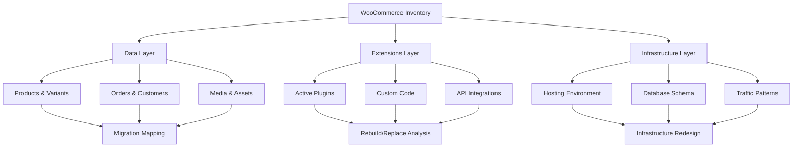

# WooCommerce to Saleor Migration Guide: Assess & Execute


Migrating from WooCommerce—a PHP-based WordPress plugin with 10,440 GitHub stars and a monolithic extension model—to Saleor—a Python/GraphQL headless commerce API with 23,167 stars—represents a fundamental architectural shift from content-centric monolith to API-first composable commerce. WooCommerce operates within the WordPress ecosystem, tightly coupling storefront rendering, business logic, and data storage. Saleor exposes all commerce functionality via a GraphQL API, requiring separate frontend implementation and webhook-driven extensibility. This guide provides a decision framework and phased execution plan for teams considering or actively planning this transition.

Migration is justified when you require native headless architecture, technology-agnostic extensibility, or multichannel control at the API level that WooCommerce's plugin model cannot deliver without significant custom development. Migration is *not* justified if your primary need is simple storefront customization, your team lacks experience with API-first architectures, or your catalog and order volume fit comfortably within WordPress hosting constraints. The effort to migrate data, rebuild frontend experiences, and reimplement integrations is substantial—this guide equips you to assess whether that investment aligns with your technical and business requirements.

## Table of Contents

- [Platform Architecture Comparison](#platform-architecture-comparison)
- [Suitability Assessment Matrix](#suitability-assessment-matrix)
- [Pre-Migration Inventory](#pre-migration-inventory)
- [Compatibility Risks and Blockers](#compatibility-risks-and-blockers)
- [Phased Migration Plan](#phased-migration-plan)
- [Data and API Migration Strategy](#data-and-api-migration-strategy)
- [Test Strategy and Quality Gates](#test-strategy-and-quality-gates)
- [Rollback Gates and Contingency](#rollback-gates-and-contingency)
- [When Migration Is Not Justified](#when-migration-is-not-justified)
- [Decision Checklist](#decision-checklist)
- [Evidence, Assumptions, and Limitations](#evidence-assumptions-and-limitations)
- [Frequently Asked Questions](#frequently-asked-questions)
- [Sources](#sources)

---

## Platform Architecture Comparison

The architectural differences between WooCommerce and Saleor determine migration complexity and long-term maintainability.

| Dimension | WooCommerce | Saleor |
|-----------|-------------|--------|
| **Core language** | PHP (WordPress plugin) | Python |
| **API paradigm** | REST (legacy), WP REST API extensions | GraphQL-only |
| **Deployment model** | Monolith (WordPress core + plugin) | Decoupled API service |
| **Frontend coupling** | Tightly coupled (WordPress themes) | Headless (separate frontend required) |
| **Extensibility model** | PHP hooks, filters, and plugins within WordPress runtime | Webhooks, apps, API extensions (service-oriented) |
| **Data storage** | WordPress database schema (wp_posts, wp_postmeta, custom tables) | PostgreSQL with dedicated commerce schema |
| **Multichannel** | Plugin-dependent (e.g., marketplace extensions) | Native per-channel pricing, currency, stock control |
| **License** | Unknown (per repository metadata; typically GPL-compatible) | BSD-3-Clause |
| **Repository structure** | Monorepo (plugins/woocommerce, packages, tools) | Single repository (Python application) |
| **Latest stable release** | [10.9.4](https://github.com/woocommerce/woocommerce/releases/tag/10.9.4) (July 2026) | [3.23.23](https://github.com/saleor/saleor/releases/tag/3.23.23) (July 2026) |
| **Open issues** | 1,947 | 252 |

> [!NOTE]
> Open issue counts reflect repository activity and community engagement, not defect density. WooCommerce's higher count correlates with broader WordPress ecosystem use; Saleor's count reflects a smaller, more focused developer base.

### Architectural Implications (Inferred from Repository Structure)

WooCommerce's [monorepo structure](https://github.com/woocommerce/woocommerce) contains the core plugin, JavaScript packages (React-based admin UI), PHP packages, and development tools managed via PNPM and Composer. This indicates a move toward modularization within the WordPress constraint. Saleor's repository contains a single Python application with [webhook](https://docs.saleor.io/developer/extending/webhooks/overview), [app](https://docs.saleor.io/developer/extending/apps/overview), and [subscription query](https://docs.saleor.io/developer/extending/webhooks/subscription-webhook-payloads) extensibility models that operate outside the core runtime.

The shift from WooCommerce's aspect-oriented plugin model (hooks/filters running in the same process) to Saleor's event-driven webhook model (HTTP calls to external services) fundamentally changes how you build and deploy custom logic.

---

## Suitability Assessment Matrix

Use this matrix to evaluate whether Saleor is a better fit than WooCommerce for your use case.


| Criterion | Favors WooCommerce | Favors Saleor |
|-----------|-------------------|---------------|
| **Content and commerce integration** | Unified content management (WordPress CMS + WooCommerce) | Separate CMS for content, Saleor for commerce API |
| **Existing WordPress ecosystem** | Leverage existing themes, plugins, hosting | No dependency on WordPress infrastructure |
| **Team skill set** | PHP, WordPress, MySQL expertise | Python, GraphQL, PostgreSQL, API-first development |
| **Storefront requirements** | Traditional server-rendered themes | Modern JavaScript frameworks (Next.js, React, Vue) |
| **Extensibility preference** | Plugins within monolith runtime | Microservices, webhooks, independent app deployment |
| **Multichannel complexity** | Single or simple multi-store setup | Per-channel pricing, currency, warehouse, product control |
| **Deployment and scaling** | Shared hosting, managed WordPress platforms | Containerized services (Docker, Kubernetes), cloud-native |
| **API-first requirements** | API secondary to WordPress admin workflow | API primary interface for all operations |
| **Upgrade and maintenance** | Plugin compatibility conflicts common | Independent service upgrades |
| **Budget and timeline** | Lower initial migration cost | Higher upfront investment in API architecture |

> [!TIP]
> If your score skews toward WooCommerce but you need headless capabilities, consider WooCommerce with a headless WordPress setup (decoupled frontend consuming WP REST API) before committing to full migration.

---

## Pre-Migration Inventory

Before migration, catalog your WooCommerce environment to estimate effort and identify dependencies.

### Data Inventory

- **Products**: Count simple, variable, grouped, external, and subscription products. Note custom fields stored in `wp_postmeta`.
- **Orders**: Total order count, order statuses, refund/return records, and custom order metadata.
- **Customers**: User accounts in WordPress `wp_users`, guest checkouts, and associated metadata.
- **Categories and tags**: Taxonomy terms in `wp_terms` and `wp_term_taxonomy`.
- **Media**: Product images, galleries, and downloadable files in WordPress media library.
- **Attributes**: Custom product attributes and variations.
- **Coupons and discounts**: WooCommerce coupon types and usage history.
- **Payment gateways**: Active payment methods and transaction records.
- **Shipping zones and methods**: Configured zones, rates, and conditional logic.

### Extension and Customization Inventory

- **Active plugins**: List WooCommerce extensions (subscriptions, memberships, bookings, etc.) and third-party integrations (CRM, email, analytics).
- **Theme customizations**: Custom PHP templates, hooks, and filters in child themes.
- **Custom code**: Functions added to `functions.php` or custom plugins.
- **API integrations**: External services consuming WooCommerce REST API or custom endpoints.

### Infrastructure Inventory

- **Hosting environment**: Shared hosting, VPS, managed WordPress, or cloud (AWS, GCP, Azure).
- **Database size**: MySQL database size and performance constraints.
- **Traffic and load**: Current request volume, peak traffic periods, and performance bottlenecks.
- **Monitoring and logging**: Existing observability stack (New Relic, Datadog, custom logs).



---

## Compatibility Risks and Blockers

Saleor's architecture eliminates certain WooCommerce patterns, creating migration blockers if not addressed.

### Hard Blockers

1. **Tightly coupled WordPress functionality**: If commerce logic depends on WordPress core features (user roles, post types, shortcodes) beyond simple authentication, extensive refactoring is required.
2. **Plugin-dependent features without Saleor equivalent**: Some WooCommerce extensions (e.g., specialized booking systems, complex subscription rules) may require custom Saleor app development.
3. **Team skill gap**: Lack of Python, GraphQL, or API-first development experience significantly increases risk and timeline.
4. **Monolithic frontend**: If the WooCommerce storefront and WordPress content are deeply intertwined in theme templates, separating them requires substantial frontend rebuilding.

### Medium-Risk Areas

- **Payment gateway migration**: WooCommerce payment plugins must be replaced with Saleor-compatible integrations (Stripe, Braintree, Adyen). Custom gateways require webhook implementation.
- **Shipping logic**: Complex shipping rules in WooCommerce plugins must be reimplemented as Saleor shipping methods or external app logic.
- **SEO and URL structure**: WooCommerce URLs (e.g., `/product/slug/`) differ from headless frontend routing. Redirects and canonical URL mapping are necessary.
- **Custom product types**: WooCommerce product types (e.g., bookings, memberships) must map to Saleor's product model or be handled via apps and metadata.
- **Reporting and analytics**: WooCommerce admin reports must be replaced with Saleor dashboard or custom analytics integrations.

### Low-Risk Areas

- **Basic catalog and order data**: Standard product, category, customer, and order data map well to Saleor's schema.
- **Static content**: Marketing pages in WordPress can remain on WordPress or migrate to a separate CMS (Contentful, Sanity, etc.).
- **Email templates**: WooCommerce email templates can be rebuilt in Saleor's email system or external services (SendGrid, Postmark).

> [!WARNING]
> If more than 30% of your commerce functionality depends on WooCommerce-specific plugins without clear Saleor equivalents, plan for 3–6 months of custom development before data migration begins.

---

## Phased Migration Plan

A phased approach minimizes risk and allows iterative validation.

### Phase 1: Architecture and Proof of Concept (4–8 weeks)

**Goal**: Validate Saleor can meet technical requirements.

- **Week 1–2**: Deploy Saleor sandbox (local via [Docker Compose](https://docs.saleor.io/setup/docker-compose) or [Saleor Cloud](https://cloud.saleor.io) developer account).
- **Week 3–4**: Implement one critical user flow (e.g., product listing, add to cart, checkout) in a headless frontend (Next.js, React).
- **Week 5–6**: Develop webhook or app prototype for one custom integration (payment gateway, shipping, or ERP).
- **Week 7–8**: Conduct load testing with representative product and order volume.

**Deliverable**: Go/no-go decision with risk assessment and timeline estimate.

### Phase 2: Data Migration and Schema Mapping (6–10 weeks)

**Goal**: Migrate historical data without disrupting live WooCommerce site.

- **Week 1–2**: Export WooCommerce data (products, orders, customers) to CSV or JSON via WP-CLI or custom scripts.
- **Week 3–5**: Develop migration scripts to transform WooCommerce schema to Saleor GraphQL mutations (product creation, variant mapping, customer import).
- **Week 6–7**: Migrate media assets to Saleor storage (S3, GCS, or Saleor's media backend).
- **Week 8–9**: Import data into staging Saleor instance and validate integrity (product counts, order totals, customer records).
- **Week 10**: Incremental sync strategy for orders placed during migration window.

**Deliverable**: Staging Saleor instance with full historical data.

### Phase 3: Frontend and Integration Rebuild (8–16 weeks)

**Goal**: Rebuild storefront and critical integrations.

- **Week 1–4**: Develop headless storefront (see [Saleor React Storefront](https://github.com/saleor/storefront) as reference).
- **Week 5–8**: Implement checkout, payment, and order confirmation flows.
- **Week 9–12**: Rebuild custom integrations (CRM, email, analytics) as Saleor webhooks or apps.
- **Week 13–16**: Replicate WooCommerce admin workflows in Saleor dashboard or custom admin tools.

**Deliverable**: Feature-complete storefront and admin workflows.

### Phase 4: Testing and Cutover (4–6 weeks)

**Goal**: Validate production readiness and execute cutover.

- **Week 1–2**: User acceptance testing (UAT) with internal team and beta customers.
- **Week 3**: Final data sync and cutover rehearsal.
- **Week 4**: DNS cutover, redirect legacy URLs, monitor traffic and errors.
- **Week 5–6**: Post-launch stabilization and bug fixes.

**Deliverable**: Live Saleor production environment.

---

## Data and API Migration Strategy

### Data Export from WooCommerce

**Option 1: WP-CLI and SQL**

```bash
# Export products
wp post list --post_type=product --format=json > products.json

# Export orders
wp post list --post_type=shop_order --format=json > orders.json

# Export customers (WordPress users with customer role)
wp user list --role=customer --format=json > customers.json
```

**Option 2: WooCommerce REST API**

Use WooCommerce REST API v3 to programmatically export data:

```python
import requests
from requests.auth import HTTPBasicAuth

url = "https://yoursite.com/wp-json/wc/v3/products"
auth = HTTPBasicAuth('consumer_key', 'consumer_secret')

response = requests.get(url, auth=auth)
products = response.json()
```

**Option 3: Database SQL Queries**

Direct SQL export for complex custom fields:

```sql
SELECT p.ID, p.post_title, p.post_content, pm.meta_key, pm.meta_value
FROM wp_posts p
LEFT JOIN wp_postmeta pm ON p.ID = pm.post_id
WHERE p.post_type = 'product';
```

### Data Import to Saleor

Saleor provides a [GraphQL API](https://docs.saleor.io/api-usage/overview) for all data mutations. Example product import:

```graphql
mutation {
  productCreate(input: {
    name: "Sample Product",
    productType: "default-product-type",
    category: "category-id",
    slug: "sample-product"
  }) {
    product {
      id
      name
    }
    errors {
      field
      message
    }
  }
}
```

**Bulk import script** (Python example):

```python
import requests
import json

GRAPHQL_URL = "https://your-saleor-instance.com/graphql/"
HEADERS = {"Authorization": "Bearer YOUR_TOKEN"}

def import_product(product_data):
    mutation = """
    mutation($name: String!, $slug: String!) {
      productCreate(input: {name: $name, slug: $slug, productType: "..."}) {
        product { id }
        errors { message }
      }
    }
    """
    response = requests.post(GRAPHQL_URL, json={"query": mutation, "variables": product_data}, headers=HEADERS)
    return response.json()

# Iterate over exported WooCommerce products
for product in woocommerce_products:
    saleor_data = transform_to_saleor(product)  # Custom mapping function
    import_product(saleor_data)
```

### Schema Mapping Table

| WooCommerce Entity | Saleor Equivalent | Notes |
|-------------------|-------------------|-------|
| Product (simple) | Product | Direct mapping |
| Product (variable) | Product with ProductVariant | WooCommerce variations become Saleor variants |
| Product category | Category | Hierarchical structure preserved |
| Product tag | Collection | Tags map to Saleor collections |
| Customer (wp_users) | User | Email and metadata migrate; password reset required |
| Order (shop_order) | Order | Order line items, totals, and status migrate |
| Coupon | Voucher | Discount rules require manual review |
| Product attribute | Attribute | Custom attributes map to Saleor metadata or attributes |
| Product image | ProductMedia | URLs must be updated or assets re-uploaded |

> [!TIP]
> Use Saleor's [metadata](https://docs.saleor.io/api-usage/metadata) fields to store WooCommerce IDs and custom data that doesn't fit the Saleor schema. This enables bidirectional reference during incremental migration.

---

## Test Strategy and Quality Gates

### Testing Phases

| Phase | Focus | Tools | Success Criteria |
|-------|-------|-------|------------------|
| **Unit testing** | Data transformation scripts | pytest, unittest | 100% of exported records transform without error |
| **Integration testing** | GraphQL mutations, API responses | Postman, GraphQL Playground | All CRUD operations succeed for products, orders, customers |
| **Functional testing** | Storefront user flows | Playwright, Cypress | Checkout, payment, order confirmation complete without errors |
| **Performance testing** | API load, database queries | Locust, k6, pgBench | API response time < 200ms for 95th percentile under 1000 req/s |
| **UAT** | Business process validation | Manual testing by stakeholders | All critical workflows approved by business users |
| **Data validation** | Migrated data accuracy | Custom SQL queries, data diffs | < 0.1% discrepancy in product count, order totals, customer records |

### Quality Gates

- **Gate 1 (Phase 1)**: POC demonstrates critical user flow with acceptable performance.
- **Gate 2 (Phase 2)**: Staging data matches WooCommerce production within tolerance (0.1% error rate).
- **Gate 3 (Phase 3)**: UAT passes with zero P0 issues and < 5 P1 issues.
- **Gate 4 (Phase 4)**: Smoke tests pass post-cutover; no customer-facing errors for 24 hours.

---

## Rollback Gates and Contingency

### Rollback Decision Points

1. **Pre-cutover (DNS change)**: If final data sync fails or UAT reveals critical issues, delay cutover.
2. **Post-cutover (first 24 hours)**: If error rate exceeds 5% or checkout completion drops > 20%, revert DNS to WooCommerce.
3. **Post-cutover (first week)**: If revenue drops > 15% or customer complaints spike, evaluate rollback vs. rapid fixes.

### Rollback Procedure

- **DNS reversion**: Update DNS A/CNAME records to point to WooCommerce hosting (5–60 minute propagation).
- **Order sync**: Manually export orders created in Saleor during cutover window and import to WooCommerce (if rolled back within 24 hours).
- **Communication**: Notify customers of temporary issue and expected resolution time.

### Contingency for Partial Failure

- **Hybrid operation**: Run Saleor for new orders while keeping WooCommerce read-only for historical order lookup (requires custom integration).
- **Phased customer rollout**: Migrate a percentage of traffic (e.g., 10%) to Saleor using load balancer or feature flags, monitor metrics, and gradually increase.

> [!WARNING]
> Rollback windows close rapidly once customers place orders in Saleor. Plan for 24-hour maximum rollback window unless bidirectional order sync is implemented.

---

## When Migration Is Not Justified

Migration to Saleor is **not** recommended if:

1. **WordPress integration is core to your business model**: If content and commerce are inseparable (e.g., blog-driven affiliate sales with WooCommerce checkout), the decoupling cost outweighs benefits.
2. **Your team lacks API-first development experience**: Without in-house or contracted expertise in GraphQL, Python, and headless frontend development, migration risk is unacceptably high.
3. **WooCommerce meets current and projected needs**: If your catalog is < 5,000 products, order volume is < 1,000/month, and you have no multichannel requirements, WooCommerce's simplicity is an advantage.
4. **Budget and timeline constraints are tight**: Migration requires 6–12 months and $50k–$500k+ in development costs (depending on customization complexity). If you need results in < 3 months, invest in WooCommerce optimization instead.
5. **You rely heavily on niche WooCommerce plugins**: If critical functionality depends on plugins with no Saleor equivalent (e.g., specialized booking engines, complex subscription logic), custom development may be cost-prohibitive.
6. **Hosting and scaling are not current pain points**: If your WooCommerce site performs acceptably on current infrastructure, the operational complexity of Saleor's service-oriented architecture adds cost without immediate benefit.

### Alternatives to Full Migration

- **Headless WooCommerce**: Use WooCommerce as a backend API with a decoupled frontend (Next.js consuming WP REST API). This retains WordPress familiarity while modernizing the frontend.
- **WooCommerce optimization**: Invest in caching (Redis, Varnish), database optimization, and premium hosting (WP Engine, Kinsta) to improve performance without migration.
- **Hybrid approach**: Use Saleor for new business units or markets while maintaining WooCommerce for legacy operations.

---

## Decision Checklist

Use this checklist to finalize your migration decision.

- [ ] **Business justification**: Clear ROI identified (e.g., multichannel expansion, performance at scale, reduced technical debt).
- [ ] **Technical assessment**: POC completed and validates Saleor can handle critical workflows.
- [ ] **Team capability**: In-house or contracted expertise in Python, GraphQL, and headless architecture confirmed.
- [ ] **Data inventory**: Complete catalog of WooCommerce data, extensions, and custom code documented.
- [ ] **Compatibility review**: No hard blockers identified; medium-risk areas have mitigation plans.
- [ ] **Timeline and budget**: 6–12 month timeline and budget of $50k–$500k+ approved.
- [ ] **Stakeholder alignment**: Business, engineering, and operations teams aligned on goals and risks.
- [ ] **Rollback plan**: DNS reversion and order sync procedures documented and tested.
- [ ] **UAT plan**: Test scenarios and success criteria defined with business stakeholders.
- [ ] **Post-launch support**: On-call schedule and monitoring dashboards prepared for cutover week.

---

## Evidence, Assumptions, and Limitations

### Evidence Base

This guide is grounded in:

- [WooCommerce repository](https://github.com/woocommerce/woocommerce) metadata (10,440 stars, 1,947 open issues, PHP/WordPress architecture).
- [Saleor repository](https://github.com/saleor/saleor) metadata (23,167 stars, 252 open issues, Python/GraphQL architecture).
- Repository README content describing monorepo structure (WooCommerce) and API-first extensibility (Saleor).
- Latest release versions: WooCommerce [10.9.4](https://github.com/woocommerce/woocommerce/releases/tag/10.9.4) and Saleor [3.23.23](https://github.com/saleor/saleor/releases/tag/3.23.23) as of July 2026.

### Architectural Inferences

Conclusions about extensibility models (plugins vs. webhooks), deployment patterns (monolith vs. service-oriented), and frontend coupling are inferred from repository structure and README descriptions. These are not benchmarked performance claims.

### Assumptions

- **Data complexity**: Assumes standard WooCommerce product types and order structures. Highly customized schemas may require additional mapping effort.
- **Team size and expertise**: Timeline estimates assume a team of 3–5 developers with prior API-first and headless commerce experience.
- **Infrastructure**: Assumes cloud-based deployment (AWS, GCP, Azure) for Saleor. Self-hosted or on-premises deployments may alter cost and complexity.

### Limitations

- **No benchmark data**: This guide does not include performance benchmarks, conversion rate impacts, or migration timelines from real-world case studies.
- **No version-specific compatibility**: WooCommerce 10.x and Saleor 3.x are current as of this publication (August 2026 data retrieval). Future major versions may introduce breaking changes.
- **No plugin-specific migration paths**: Guidance is general; specific WooCommerce extensions (WooCommerce Subscriptions, WooCommerce Memberships, etc.) require individual analysis.

---

## Frequently Asked Questions

### Can I migrate incrementally, keeping WooCommerce for some products?

Incremental migration is technically possible but operationally complex. You would need to route traffic by product category or customer segment, synchronize inventory between systems, and manage two admin interfaces. This approach is justified only for large enterprises with dedicated integration teams. For most teams, a phased cutover (all products migrate at once) is simpler.

### How do I handle orders placed during the migration cutover window?

Implement a brief maintenance mode (1–4 hours) during final data sync and DNS cutover. Alternatively, build a bidirectional order sync that writes new WooCommerce orders to Saleor immediately post-cutover. The maintenance window approach is simpler and lower risk for most teams.

### What happens to my WordPress content (blog, pages) after migration?

WordPress can remain as your content management system, decoupled from commerce. Your headless storefront can fetch blog posts and pages from WordPress via the WP REST API, or you can migrate content to a dedicated headless CMS (Contentful, Sanity, Strapi). Saleor does not replace WordPress for content; it replaces WooCommerce for commerce.

### Do I need to rebuild all WooCommerce extensions as Saleor apps?

Not all extensions require rebuilding. Payment gateways and shipping methods have Saleor-native integrations or can be implemented via webhooks. Complex custom functionality (subscription billing, membership logic, booking systems) will require custom Saleor app development. Evaluate each extension individually during the pre-migration inventory phase.

### Can I reuse my WooCommerce theme and frontend after migration?

No. WooCommerce themes are PHP-based WordPress templates tightly coupled to the WordPress rendering pipeline. Saleor requires a separate headless frontend built with JavaScript frameworks (Next.js, React, Vue, etc.). You can replicate the design and UX of your WooCommerce theme, but the code must be rewritten. Reference the [Saleor React Storefront](https://github.com/saleor/storefront) as a starting point.

### What is the total cost of ownership difference between WooCommerce and Saleor?

WooCommerce's lower entry cost (shared hosting, free plugin) is offset by scaling challenges and plugin license fees. Saleor's higher upfront cost (infrastructure, development) is offset by operational simplicity at scale (independent service upgrades, no plugin conflicts). For small stores (< 1,000 orders/month), WooCommerce is cheaper. For high-volume or multichannel operations, Saleor's long-term cost is competitive or lower. Conduct a 3-year TCO analysis with your specific hosting, development, and extension costs.

### How long does a typical WooCommerce to Saleor migration take?

Timeline depends on data volume, custom code complexity, and team experience. Small stores (< 1,000 products, minimal customization) can migrate in 3–4 months. Medium stores (1,000–10,000 products, moderate extensions) require 6–9 months. Large stores (> 10,000 products, heavy customization) require 9–18 months. Use the phased plan in this guide as a baseline and adjust for your specific context.

---

## Sources

- [WooCommerce canonical repository](https://github.com/woocommerce/woocommerce)
- [WooCommerce latest GitHub release](https://github.com/woocommerce/woocommerce/releases/tag/10.9.4)
- [Saleor canonical repository](https://github.com/saleor/saleor)
