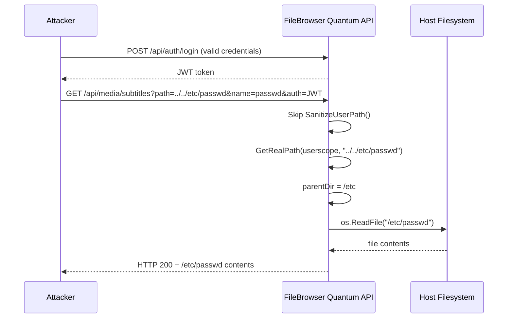

# CVE-2026-54910: FileBrowser Quantum Path Traversal Alert


GitHub Security Advisory [GHSA-vvp7-h4fj-m28w](https://github.com/advisories/GHSA-vvp7-h4fj-m28w) published on July 31, 2026, discloses CVE-2026-54910, a high-severity path traversal vulnerability in FileBrowser Quantum—a Go-based file management web application. The flaw permits any authenticated user to read arbitrary text files accessible to the server process, including system credentials, SSH keys, and application secrets. **Svelte itself is not affected.** This alert is issued for ecosystem awareness because security advisories are sometimes miscategorized or appear in tangential search results, and engineering teams maintaining Svelte-based applications may operate infrastructure that includes vulnerable file management tools.

The vulnerability exists in two independent attack vectors within the `subtitlesHandler` endpoint (`GET /api/media/subtitles`): the `path` query parameter bypasses path sanitization entirely, and the `name` parameter permits directory traversal through unsanitized `filepath.Join` operations. No elevated permissions are required; basic authentication suffices. A patch commit `0.0.0-20260608182036-f3f4bbe80cb5` was released and all prior versions are considered vulnerable.

---

## Table of Contents

- [Severity and Scope](#severity-and-scope)
- [Technology Affected and Dependency Analysis](#technology-affected-and-dependency-analysis)
- [Vulnerability Details](#vulnerability-details)
- [Exploitation Scenarios](#exploitation-scenarios)
- [Incident Response Checklist](#incident-response-checklist)
- [Verification and Remediation](#verification-and-remediation)
- [Evidence, Assumptions, and Limitations](#evidence-assumptions-and-limitations)
- [Frequently Asked Questions](#frequently-asked-questions)
- [Sources](#sources)

---

## Severity and Scope

> [!WARNING]
> **Critical Impact for FileBrowser Quantum Users**  
> Any authenticated user—regardless of role or assigned permissions—can exploit this vulnerability to read arbitrary files on the host filesystem, including `/etc/passwd`, private keys, database credentials, and JWT signing secrets. Immediate patching is required.

| Attribute | Value |
|-----------|-------|
| **CVE Identifier** | CVE-2026-54910 |
| **GHSA Identifier** | GHSA-vvp7-h4fj-m28w |
| **Affected Package** | `github.com/gtsteffaniak/filebrowser/backend` (Go) |
| **Severity** | High |
| **CVSS Score** | Not specified in advisory |
| **Attack Vector** | Network, authenticated |
| **Attack Complexity** | Low |
| **Privileges Required** | Low (any authenticated user) |
| **User Interaction** | None |
| **Scope** | Changed (host filesystem access) |
| **Confidentiality Impact** | High (arbitrary file read) |
| **Integrity Impact** | None (read-only) |
| **Availability Impact** | None |
| **Published** | 2026-07-31 |
| **Patched Version** | `0.0.0-20260608182036-f3f4bbe80cb5` |

### Affected Version Range

| Package | Ecosystem | Vulnerable Versions | Patched Versions |
|---------|-----------|---------------------|------------------|
| `github.com/gtsteffaniak/filebrowser/backend` | Go | All versions before `0.0.0-20260608182036-f3f4bbe80cb5` | `0.0.0-20260608182036-f3f4bbe80cb5` and later |

---

## Technology Affected and Dependency Analysis

### Svelte Is Not Affected

**Svelte** ([GitHub repository](https://github.com/sveltejs/svelte)) is a JavaScript compiler for building reactive web user interfaces. As of the data retrieval date (August 3, 2026), the [latest release is svelte@5.56.8](https://github.com/sveltejs/svelte/releases/tag/svelte%405.56.8), published July 24, 2026. Svelte is implemented in JavaScript, distributed via npm, and has no runtime or build-time dependency on Go packages or FileBrowser Quantum.

> [!NOTE]
> **Why This Alert Was Issued**  
> MadeWithWhat issues ecosystem-adjacent security alerts when:
> 1. Advisories may appear in aggregated feeds or search results related to the primary technology.
> 2. Teams using the primary technology may also operate infrastructure tools that are vulnerable.
> 3. Miscategorization or tagging errors in vulnerability databases can cause confusion.

### FileBrowser Quantum Overview

FileBrowser Quantum is a fork of the original FileBrowser project, providing a web-based file management interface with media preview, user scoping, and permissions. It is written in Go and commonly deployed as a Docker container (`gtsteffaniak/filebrowser`) for personal cloud storage, media servers, and administrative dashboards. The project is **not a dependency** of Svelte, SvelteKit, Vite, or any mainstream JavaScript toolchain.

### Dependency Chain Relevance

The advisory explicitly names `github.com/gtsteffaniak/filebrowser/backend` as the affected Go module. A dependency analysis of Svelte reveals:

- **No Go modules** in the build or runtime chain.
- **No transitive dependencies** on FileBrowser Quantum.
- **No shared attack surface** between a client-side JavaScript compiler and a server-side file management API.

Teams should evaluate this advisory only if they **independently deploy** FileBrowser Quantum for internal tooling, media management, or infrastructure operations alongside Svelte-based front-end applications.

---

## Vulnerability Details

### Root Cause Analysis

The vulnerability originates in the `subtitlesHandler` function (`http/media.go:54`) which processes two user-controlled query parameters—`path` and `name`—without adequate sanitization before filesystem operations.

#### Vector 1: Unsanitized `path` Parameter (Primary)

Line 54 of `http/media.go` calls `idx.GetRealPath(userscope, path)` directly on the user-supplied `path` parameter:

```go
realPath, _, err := idx.GetRealPath(userscope, path)  // path is raw input
parentDir := filepath.Dir(realPath)  // attacker controls parentDir
```

Every other endpoint in the codebase invokes `utils.SanitizeUserPath()` **before** `GetRealPath()`. The `SanitizeUserPath()` function explicitly rejects any path segment containing `".."` to prevent directory traversal:

```go
func SanitizeUserPath(userPath string) (string, error) {
    for _, segment := range segments {
        if segment == ".." {
            return "", fmt.Errorf("invalid path: path traversal detected")
        }
    }
}
```

By omitting this check, an attacker can supply `path=../../etc/passwd`, causing `GetRealPath()` to resolve `parentDir` to `/etc` with no anchor file required.

#### Vector 2: Unsanitized `name` Parameter (Secondary)

Line 63 constructs the subtitle file path using `filepath.Join(parentDir, name)` where `name` is raw user input:

```go
name := r.URL.Query().Get("name")  // line 37
content, err = utils.GetSubtitleSidecarContent(
    filepath.Join(parentDir, name))  // line 63
```

`filepath.Join` normalizes paths, so `filepath.Join("/srv", "../../etc/passwd")` resolves to `/etc/passwd`. This vector requires a valid file in the user's scope as the `path` anchor, but then escapes via `name`.

#### File Read Execution

The helper function `GetSubtitleSidecarContent` (`common/utils/media.go:17-43`) validates that the file is under 50 MB and contains valid UTF-8, then reads and returns the contents:

```go
func GetSubtitleSidecarContent(subtitlePath string) (string, error) {
    info, err := os.Stat(subtitlePath)
    // size and UTF-8 validation
    content, err := os.ReadFile(subtitlePath)
    return string(content), nil
}
```

Binary files or non-UTF-8 content return an empty response, but configuration files, scripts, keys, and `/etc/passwd` are typically plain text.

### Authentication and Authorization Bypass

The endpoint is protected by the `withUser` middleware, which validates a JWT:

```go
api.HandleFunc("GET /media/subtitles", withUser(subtitlesHandler))
```

However, **no permission checks** (admin, modify, share, download) are enforced within `subtitlesHandler`. Any authenticated user, including those restricted to a scoped subdirectory, can exploit both vectors.


### Exploitation Flow



---

## Exploitation Scenarios

### Scenario 1: Default Installation, No Existing Files (Vector 1)

An attacker with any valid account can read `/etc/passwd` immediately:

```bash
curl "http://filebrowser.example.com/api/media/subtitles?path=../../etc/passwd&source=srv&name=passwd&embedded=false&auth=<TOKEN>"
```

**Impact:** Enumerate system users, locate home directories for SSH key theft.

### Scenario 2: Credential and Secret Extraction

Read application configuration files:

```bash
curl "http://filebrowser.example.com/api/media/subtitles?path=../../app/config.yml&source=srv&name=config.yml&embedded=false&auth=<TOKEN>"
```

Common targets:
- `/root/.ssh/id_rsa` (if running as root)
- `/app/.env` (database credentials, API keys)
- `/etc/filebrowser.db` (JWT signing key, user hashes)
- `/var/secrets/db_password`

### Scenario 3: Scoped User Privilege Escalation

A user restricted to `/srv/userA` can escape to read files belonging to `/srv/userB` or administrative configuration:

```bash
curl "http://filebrowser.example.com/api/media/subtitles?path=../../srv/userB/private.txt&source=srv&name=private.txt&embedded=false&auth=<TOKEN>"
```

### Scenario 4: Token Forgery via JWT Key Theft

If the attacker retrieves the JWT signing key from the database or configuration file, they can forge admin tokens and escalate to full administrative control, enabling write operations, user creation, and code execution via other endpoints.

---

## Incident Response Checklist

> [!TIP]
> **Immediate Actions for FileBrowser Quantum Operators**  
> Follow this checklist if you deploy FileBrowser Quantum in production or internal infrastructure.

- [ ] **Identify Deployments:** Audit infrastructure for instances of `gtsteffaniak/filebrowser` Docker images or Go binaries.
- [ ] **Check Version:** Confirm the running version; all versions before commit `0.0.0-20260608182036-f3f4bbe80cb5` are vulnerable.
- [ ] **Review Access Logs:** Search HTTP logs for requests to `/api/media/subtitles` with suspicious `path` or `name` parameters (e.g., containing `..`, `/etc`, `/root`, `/.ssh`).
- [ ] **Inspect Authentication Logs:** Identify all user accounts with valid credentials; assume compromise if suspicious requests are found.
- [ ] **Rotate Secrets:** If logs indicate exploitation, immediately rotate:
  - JWT signing keys
  - Database passwords
  - API keys and service credentials
  - SSH keys for the server user account
- [ ] **Patch Immediately:** Update to commit `0.0.0-20260608182036-f3f4bbe80cb5` or later; rebuild and redeploy containers.
- [ ] **Network Segmentation Review:** Ensure FileBrowser is not exposed to the public internet without VPN or IP allowlisting.
- [ ] **Principle of Least Privilege:** Run FileBrowser under a dedicated, non-root user account with minimal filesystem read permissions.
- [ ] **Incident Reporting:** If sensitive data was accessed, follow organizational breach notification procedures.

### Post-Remediation Validation

After patching, verify the fix:

```bash
# Attempt traversal with patched version (should return 400 Bad Request)
curl -i "http://localhost:18080/api/media/subtitles?path=../../etc/passwd&source=srv&name=passwd&embedded=false&auth=<TOKEN>"
```

Expected response: HTTP 400 with error message `"invalid path: path traversal detected"`.

---

## Verification and Remediation

### Identifying Vulnerable Deployments

#### Docker Deployments

List running containers:

```bash
docker ps --filter ancestor=gtsteffaniak/filebrowser
```

Inspect image tags and build dates:

```bash
docker inspect gtsteffaniak/filebrowser:latest | grep -E '(Created|Image)'
```

If the image was built before June 8, 2026, it is vulnerable.

#### Binary Deployments

Check the Git commit hash of the deployed binary:

```bash
./filebrowser version
```

Compare against the patch commit `f3f4bbe80cb5`. If earlier, upgrade immediately.

### Remediation Steps

| Step | Action | Command / Procedure |
|------|--------|---------------------|
| 1 | **Stop vulnerable instance** | `docker stop <container_id>` or `systemctl stop filebrowser` |
| 2 | **Pull patched image** | `docker pull gtsteffaniak/filebrowser:latest` (verify build date > 2026-06-08) |
| 3 | **Rebuild from source** (if using Go module) | `go get github.com/gtsteffaniak/filebrowser/backend@f3f4bbe80cb5 && go build` |
| 4 | **Update configuration** | Rotate JWT secret in config file or environment variables |
| 5 | **Restart service** | `docker start <container_id>` or `systemctl start filebrowser` |
| 6 | **Verify patch** | Test traversal attempt (see Post-Remediation Validation above) |
| 7 | **Monitor logs** | Enable audit logging for `/api/media/subtitles` endpoint |

### Temporary Mitigation (If Patching Is Delayed)

If immediate patching is not feasible, apply defense-in-depth measures:

1. **Network-Level Block:** Use a reverse proxy (nginx, Caddy) to reject requests to `/api/media/subtitles` containing `..` in query parameters:

   ```nginx
   location /api/media/subtitles {
       if ($query_string ~* "\.\.") {
           return 403;
       }
       proxy_pass http://filebrowser:80;
   }
   ```

2. **Filesystem Permissions:** Restrict the FileBrowser process user to read-only access to the designated storage root; remove read permission on `/etc`, `/root`, and other sensitive directories.

3. **Disable Endpoint:** If subtitle functionality is not required, comment out the route registration in `httpRouter.go` and rebuild.

---

## Evidence, Assumptions, and Limitations

### Evidence Sources

- **GitHub Security Advisory GHSA-vvp7-h4fj-m28w** ([link](https://github.com/advisories/GHSA-vvp7-h4fj-m28w)): Official disclosure published July 31, 2026, including detailed technical analysis, proof-of-concept, and patch commit reference.
- **Svelte Repository Data** ([link](https://github.com/sveltejs/svelte)): Repository metadata retrieved August 3, 2026, confirming Svelte 5.56.8 as the latest release and verifying no Go dependencies.

### Assumptions

1. **Advisory Accuracy:** The technical details, code snippets, and patch commit hash provided in GHSA-vvp7-h4fj-m28w are assumed to be accurate and verified by the disclosing researcher and GitHub Security Lab.
2. **Patch Completeness:** Commit `0.0.0-20260608182036-f3f4bbe80cb5` is assumed to fully remediate both attack vectors by applying `SanitizeUserPath()` to `path` and `filepath.Base()` to `name`.
3. **Deployment Context:** This analysis assumes standard deployment patterns (Docker, systemd service) and does not cover exotic configurations (e.g., custom middleware, modified source code).

### Limitations

- **No CVSS Vector String:** The advisory does not include a CVSS v3.1 vector string or numeric score; severity classification is based on impact description.
- **Limited Exploit Telemetry:** No public evidence of active exploitation (e.g., Shodan scans, honeypot data) is available as of the publication date.
- **Svelte Non-Involvement:** This advisory has no bearing on Svelte's security posture, attack surface, or dependency management; it is published solely for ecosystem context.
- **Unverified Downstream Forks:** Other forks of the original FileBrowser project may contain similar vulnerabilities but are not analyzed here.

---

## Frequently Asked Questions

### Is Svelte affected by CVE-2026-54910?

No. Svelte is a JavaScript compiler with no dependencies on Go packages or FileBrowser Quantum. The advisory affects only `github.com/gtsteffaniak/filebrowser/backend`.

### Why is this alert published on a Svelte-focused site?

MadeWithWhat issues ecosystem-adjacent security alerts to help engineering teams who may operate multiple technologies. Teams using Svelte for front-end development may also deploy FileBrowser Quantum for media management or internal tooling, creating exposure via shared infrastructure.

### Can this vulnerability be exploited without authentication?

No. The `subtitlesHandler` endpoint requires a valid JWT, so an attacker must first obtain credentials through account creation (if self-registration is enabled), credential theft, or social engineering.

### Does the vulnerability allow file writes or code execution?

No. CVE-2026-54910 is a read-only path traversal. However, reading JWT signing keys or SSH private keys can enable privilege escalation or lateral movement, which may indirectly lead to write access or code execution via other attack vectors.

### How can I check if my FileBrowser instance has been exploited?

Search HTTP access logs for requests to `/api/media/subtitles` with query parameters containing `..`, `/etc`, `/root`, `/.ssh`, or other suspicious paths. Example:

```bash
grep '/api/media/subtitles' /var/log/nginx/access.log | grep -E '(\.\.|/etc|/root)'
```

### What is the recommended long-term fix?

Update to commit `0.0.0-20260608182036-f3f4bbe80cb5` or later. If using Docker, pull the latest image and verify the build date is after June 8, 2026. Implement principle of least privilege by running FileBrowser under a restricted user account.

### Are there other known vulnerabilities in FileBrowser Quantum?

This analysis covers only CVE-2026-54910. Operators should subscribe to the [FileBrowser Quantum GitHub repository](https://github.com/gtsteffaniak/filebrowser) security advisories and review all historical CVEs via the GitHub Advisory Database.

---

## Sources

1. [Svelte canonical repository](https://github.com/sveltejs/svelte)  
2. [Svelte latest GitHub release](https://github.com/sveltejs/svelte/releases/tag/svelte%405.56.8)  
3. [GitHub Security Advisory GHSA-vvp7-h4fj-m28w](https://github.com/advisories/GHSA-vvp7-h4fj-m28w)

---

**Canonical URL:** `https://madewithwhat.net/security/cve-2026-54910-filebrowser-quantum-path-traversal`  
**Last Updated:** 2026-08-01  
**Article Schema:** Security Advisory
