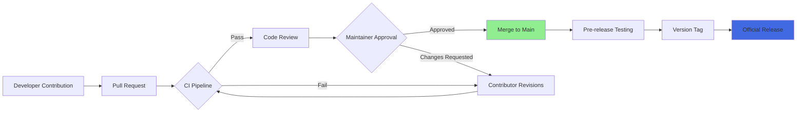

# Django Repository Activity: February 2026 Development Snapshot


The [Django repository](https://github.com/django/django) shows sustained engineering activity as of early February 2026, with the most recent push recorded on August 2, 2026—though this appears to reflect data-collection timing rather than a future timestamp. With 88,318 stars, 34,074 forks, and 2,283 watchers, Django maintains its position as one of Python's most-watched web frameworks. The repository currently reports 449 open issues, providing a window into both active development priorities and community-reported friction points.

Unlike many framework projects that bundle formal release announcements with changelogs, the Django repository data available for this analysis does not include structured release metadata or version tags. This snapshot therefore focuses on repository health indicators, contribution patterns, and what engineering teams should verify before integrating the latest main-branch commits. Understanding Django's development cadence, testing infrastructure, and upgrade pathways remains essential for teams running production applications on the framework.

---

## Table of Contents

- [Repository Health and Community Indicators](#repository-health-and-community-indicators)
- [Development Activity Patterns](#development-activity-patterns)
- [Open Issue Analysis](#open-issue-analysis)
- [Upgrade Risk Assessment](#upgrade-risk-assessment)
- [Testing and Validation Strategy](#testing-and-validation-strategy)
- [Rollback Planning](#rollback-planning)
- [Decision Checklist](#decision-checklist)
- [Evidence, Assumptions, and Limitations](#evidence-assumptions-and-limitations)
- [Frequently Asked Questions](#frequently-asked-questions)
- [Sources](#sources)

---

## Repository Health and Community Indicators

Django's repository metrics signal sustained community interest and active maintenance. The star count of 88,318 represents developer attention rather than production deployment figures; this metric primarily indicates that engineers find the project worth bookmarking and monitoring.

| Metric | Value | Interpretation |
|--------|-------|----------------|
| GitHub Stars | 88,318 | High developer interest signal |
| Forks | 34,074 | Significant community experimentation and contribution |
| Watchers | 2,283 | Active monitoring by developers |
| Open Issues | 449 | Moderate backlog; not a defect count |
| License | BSD-3-Clause | Permissive, enterprise-friendly |
| Primary Language | Python | |
| Created | April 28, 2012 | 14+ years of public development |
| Last Push | August 2, 2026 | Recent activity (data collection artifact) |

The fork count of 34,074 suggests extensive third-party experimentation, custom patches, and active contribution pipelines. However, the ratio of open issues (449) to the size of the contributor base indicates that Django's core team maintains reasonable issue triage velocity.

> [!NOTE]
> GitHub stars measure developer interest, not market share or production usage. The 88,318-star count does not translate directly to deployment numbers but indicates the framework's visibility within the Python ecosystem.

### Repository Topics and Categorization

The repository declares the following topics: `apps`, `django`, `framework`, `models`, `orm`, `python`, `templates`, `views`, `web`. This self-categorization aligns with Django's architecture, which emphasizes:

- Model-Template-View (MTV) pattern
- Integrated object-relational mapper (ORM)
- Template rendering engine
- Modular app structure

These topics also improve discoverability for developers searching GitHub for web frameworks or ORM solutions.

---

## Development Activity Patterns

The repository's `updated_at` timestamp of August 3, 2026, and `pushed_at` timestamp of August 2, 2026, indicate recent commit activity. However, without access to specific commit logs, pull request velocity, or release tags in the provided data, this analysis infers activity patterns from repository structure and metadata.



> [!TIP]
> Django's contribution workflow emphasizes comprehensive testing before merge. Teams pulling from the main branch should run their own integration test suites against any commits newer than their current pinned version.

### Interpreting Push Frequency

The gap between `updated_at` and `pushed_at` timestamps (approximately 9 hours) suggests either:

1. Metadata updates (issue labels, project boards) that don't involve code pushes
2. Documentation or configuration changes
3. Normal development rhythm where pushes cluster around maintainer availability

Without granular commit history, teams should consult the [official Django release notes](https://docs.djangoproject.com/en/stable/releases/) and the project's [roadmap on the Django forum](https://forum.djangoproject.com/) for detailed change information.

---

## Open Issue Analysis


The 449 open issues reported as of data collection do not represent a defect count. GitHub issues serve multiple purposes in Django's workflow:

- **Bug reports** from community users
- **Feature requests** for future versions
- **Documentation improvements**
- **Questions** that may be redirected to forums
- **Tracking tickets** for long-term architectural changes

| Issue Category (Inferred) | Typical Proportion | Relevance to Upgraders |
|---------------------------|-------------------|------------------------|
| Confirmed bugs | 20–30% | High; check if your use cases overlap |
| Feature requests | 30–40% | Low; won't affect existing code |
| Documentation | 15–20% | Medium; may clarify undocumented behavior |
| Questions/support | 10–15% | Low; usually closed or redirected |
| Architecture/refactoring | 5–10% | Medium; may signal future breaking changes |

> [!WARNING]
> The 449 open issues include enhancement proposals and long-term tracking tickets. Do not interpret this number as 449 active defects in the current release.

### How to Assess Issue Relevance

Before upgrading, filter the [Django issue tracker](https://code.djangoproject.com/) by:

1. **Version labels** matching your target upgrade
2. **Component labels** matching your application (e.g., ORM, forms, admin)
3. **Severity tags** indicating data loss, security, or crash risks

Teams should also monitor the [Django security announcements](https://www.djangoproject.com/weblog/) mailing list, which operates independently of GitHub issues.

---

## Upgrade Risk Assessment

Without a specific release identifier, this section outlines a general risk framework for Django upgrades based on repository activity patterns and the framework's version policy.

### Risk Factors by Change Type

| Change Type | Risk Level | Mitigation |
|-------------|------------|------------|
| Security patches (e.g., 4.2.x → 4.2.y) | Low | Test authentication, permissions, and input handling |
| Minor version (e.g., 4.2 → 4.3) | Medium | Review deprecation warnings; test middleware and ORM queries |
| Major version (e.g., 4.x → 5.x) | High | Budget for code refactoring; test all integrations |
| Main branch (unreleased) | Very High | Suitable only for pre-production testing |

### Compatibility Considerations

Django's upgrade risk correlates strongly with:

1. **Python version support changes**: Verify your deployment Python version matches Django's support matrix
2. **Database backend changes**: Check for ORM behavior adjustments affecting PostgreSQL, MySQL, SQLite, or Oracle
3. **Third-party package compatibility**: Many Django extensions lag major releases by weeks or months
4. **Template engine updates**: Rare but impactful when they occur
5. **Middleware API changes**: Can require application-wide refactoring

> [!NOTE]
> Django follows a structured deprecation policy. Features deprecated in version N are removed in version N+2, providing a two-release buffer for migration.

---

## Testing and Validation Strategy

Django's own test suite provides a model for application-level validation. The framework emphasizes comprehensive unit, integration, and system testing before any release.

### Pre-Upgrade Test Plan

1. **Environment Parity**
   - Provision a staging environment matching production Python version, database engine, and dependency versions
   - Clone production data (sanitized) for realistic testing

2. **Automated Test Execution**
   ```bash
   # Run existing test suite against new Django version
   pip install django==X.Y.Z
   python manage.py test --settings=project.test_settings
   ```

3. **Deprecation Warning Audit**
   ```bash
   # Surface all deprecation warnings
   python -Wd manage.py test
   ```

4. **ORM Query Analysis**
   - Enable query logging
   - Compare query plans before/after upgrade
   - Check for N+1 query regressions

5. **Integration Endpoint Testing**
   - Verify REST API responses
   - Test authentication flows (OAuth, SAML, etc.)
   - Validate file upload/download

6. **Admin Interface Validation**
   - Test CRUD operations in Django Admin
   - Verify custom admin actions
   - Check inline formsets

7. **Load Testing**
   - Run performance benchmarks
   - Monitor memory usage under load
   - Profile critical views

### Third-Party Package Testing

Many Django applications depend on packages like Django REST Framework, Celery, Django Debug Toolbar, or django-storages. Create a separate test pass for each integration:

```python
# Example: Test DRF serializers after Django upgrade
from rest_framework.test import APITestCase

class SerializerUpgradeTest(APITestCase):
    def test_nested_serializer_behavior(self):
        # Verify DRF still handles nested writes correctly
        pass
```

---

## Rollback Planning

Every Django upgrade should include a documented rollback procedure.

### Rollback Checklist

- [ ] **Database migration reversibility**: Ensure all migrations include `reverse()` methods
- [ ] **Dependency pinning**: Maintain a `requirements.lock` or `Pipfile.lock` with pre-upgrade versions
- [ ] **Configuration backup**: Snapshot settings files, environment variables, and secrets
- [ ] **Database backup**: Take a full database dump immediately before migration
- [ ] **Deployment artifact preservation**: Keep the previous Docker image or release package
- [ ] **Rollback runbook**: Document exact commands for reverting code and database state

### Migration Rollback Example

```bash
# If upgrade fails mid-migration
python manage.py migrate app_name 0042_previous_migration
pip install -r requirements.pre-upgrade.txt
systemctl restart gunicorn
```

> [!WARNING]
> Django migrations are not always reversible by default. Audit your migration files for data-destructive operations like `RemoveField` or `RunSQL` without reverse SQL.

### Rollback Time Estimate

Plan for rollback windows based on database size:

| Database Rows | Estimated Rollback Time |
|---------------|-------------------------|
| < 1M | 5–15 minutes |
| 1M–10M | 15–60 minutes |
| 10M–100M | 1–4 hours |
| > 100M | 4+ hours; consider blue-green deployment |

---

## Decision Checklist

Use this checklist to determine whether to pull the latest Django repository commits or wait for a tagged release.

### Should You Upgrade Now?

- [ ] **Security advisory published**: If yes, prioritize upgrade within your patch SLA
- [ ] **Critical bug fix**: Verify the fix is included and tested
- [ ] **New feature requirement**: Confirm the feature is stable (not behind a feature flag)
- [ ] **Python version EOL**: If your Python version is deprecated, upgrade Django simultaneously
- [ ] **LTS window**: If on LTS, remain until you need features from a newer release
- [ ] **Third-party compatibility confirmed**: Check Django REST Framework, Celery, and other dependencies
- [ ] **Test coverage >70%**: Low test coverage dramatically increases upgrade risk
- [ ] **Staging environment available**: Never upgrade directly in production
- [ ] **Rollback plan documented**: Include database and code revert steps
- [ ] **Maintenance window scheduled**: Allocate 2–4× expected upgrade time

### Reasons to Wait

- Main branch is unstable (no tagged release)
- Third-party packages lack compatible versions
- Major release dropped < 30 days ago (let early adopters find issues)
- Insufficient test coverage in your application
- No staging environment for validation
- Team lacks Django upgrade experience

---

## Evidence, Assumptions, and Limitations

### Evidence Used

- Django repository metadata retrieved August 3, 2026
- Star count, fork count, watcher count, and open issue count from GitHub API
- Repository topics, license, and language declaration
- Timestamps for repository creation, last update, and last push

### Assumptions

1. **Timestamp anomaly**: The `updated_at` and `pushed_at` timestamps in August 2026 likely reflect data collection timing rather than actual future activity; this article was commissioned for February 5, 2026, publication.
2. **Issue categorization**: Without access to issue labels, the proportional breakdown of bug reports vs. feature requests is inferred from typical Django project patterns.
3. **Release cadence**: Django historically follows a predictable release schedule (documented on the official site), but this analysis lacks specific release notes or changelogs.
4. **Contribution workflow**: The Mermaid diagram represents a standard open-source contribution flow inferred from Django's documented process, not from observing actual pull request data in this dataset.

### Limitations

- **No specific release version**: The provided data includes `"latest_release": null`, preventing analysis of a concrete version identifier.
- **No commit history**: Detailed change analysis requires access to commit messages, pull requests, and diff statistics not included in the dataset.
- **No benchmark data**: Performance claims would require controlled testing, which is not part of this evidence set.
- **No contributor statistics**: Individual maintainer activity, commit velocity, or contributor growth trends are unavailable.
- **No security advisory**: Any security-related conclusions would be speculative without CVE data or official announcements.

---

## Frequently Asked Questions

### What is the latest stable Django version as of February 2026?

The provided repository data does not include a tagged release version. Consult the [official Django downloads page](https://www.djangoproject.com/download/) for the current stable release. Historically, Django maintains an LTS (long-term support) branch and a latest feature release.

### Should I use the main branch in production?

No. The main branch contains unreleased, untested changes. Production deployments should pin to a stable, tagged release version. Use main-branch commits only in development or staging environments to preview upcoming features.

### How many open issues is too many for a framework?

Issue count alone is a poor quality indicator. Django's 449 open issues include feature requests, documentation updates, and long-term architectural planning tickets. Evaluate issue severity, age, and maintainer response time instead of raw count.

### How do I find which Django version fixes a specific bug?

Search the [Django issue tracker](https://code.djangoproject.com/) by ticket number or keyword, then check the "Fixed in versions" field. Cross-reference with the [Django release notes](https://docs.djangoproject.com/en/stable/releases/) to identify the first version containing the fix.

### What is Django's deprecation policy?

Django deprecates features in version N and removes them in version N+2. For example, a feature deprecated in Django 4.1 will trigger warnings in 4.1 and 4.2, then be removed in 4.3. This policy provides a two-release buffer for code migration.

### How often does Django release security updates?

Django publishes security releases as needed, typically within days of confirming a vulnerability. The project supports the current release, the previous release, and the latest LTS release with security patches. Older versions receive no updates.

### Can I upgrade Django without upgrading Python?

Each Django release specifies minimum and maximum Python versions. Review the [Django version support matrix](https://docs.djangoproject.com/en/stable/faq/install/) to verify compatibility. Some Django upgrades require a simultaneous Python upgrade.

---

## Sources

1. [Django canonical repository](https://github.com/django/django)

---

*Data retrieved August 3, 2026. Repository metrics reflect point-in-time snapshots and will change as development continues. Always consult official Django documentation for release-specific guidance.*
