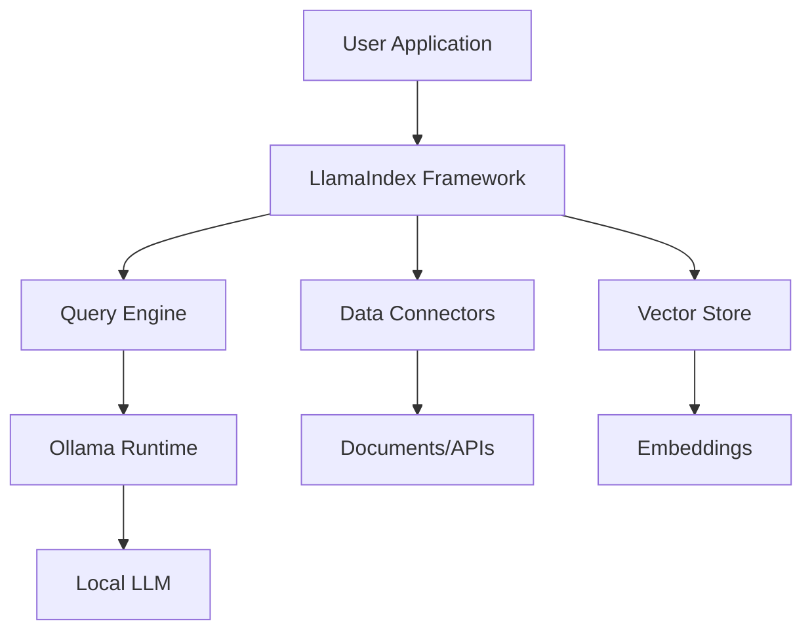

LlamaIndex and Ollama occupy distinct layers in the LLM application stack. LlamaIndex is a Python data framework for building retrieval-augmented generation (RAG) and agentic applications, while Ollama is a Go-based runtime for running large language models locally. Understanding where they differ—and how they complement each other—is essential for architecting production LLM systems.

This comparison evaluates both tools using their February 2026 GitHub snapshots: LlamaIndex at 51.3k stars with 608 open issues, and Ollama at 177.6k stars with 3,578 open issues. Both projects are MIT-licensed and under active development.


## Table of Contents

- [Architectural roles and scope](#architectural-roles-and-scope)
- [Integration patterns and compatibility](#integration-patterns-and-compatibility)
- [Development workflow and deployment](#development-workflow-and-deployment)
- [Performance and resource considerations](#performance-and-resource-considerations)
- [Community and ecosystem maturity](#community-and-ecosystem-maturity)
- [Decision matrix](#decision-matrix)
- [Migration and coexistence strategies](#migration-and-coexistence-strategies)
- [Project fit recommendations](#project-fit-recommendations)
- [Evidence, assumptions, and limitations](#evidence-assumptions-and-limitations)
- [Decision checklist](#decision-checklist)
- [FAQ](#faq)
- [Sources](#sources)

## Architectural roles and scope

LlamaIndex and Ollama address separate concerns in LLM application development. LlamaIndex is a **data orchestration framework** that handles document ingestion, indexing, retrieval, and query orchestration. Ollama is an **inference runtime** that downloads, manages, and serves language models via a local API server.

### LlamaIndex: Data framework and RAG orchestration

Based on the [repository structure](https://github.com/run-llama/llama_index), LlamaIndex provides:

- **Data connectors** for 300+ integrations (APIs, PDFs, databases, vector stores)
- **Indexing structures** including vector stores, knowledge graphs, and document hierarchies
- **Query engines** with advanced retrieval patterns (hybrid search, reranking, routing)
- **Agent frameworks** through the `llama-index-core` package and LlamaAgents subproject
- **LlamaParse platform** for document parsing, extraction, and agentic OCR (separate commercial offering)

The framework is split into `llama-index-core` (base abstractions) and 300+ integration packages on [LlamaHub](https://llamahub.ai/). This modular design inferred from the README allows developers to install only required components:

```python
from llama_index.core import VectorStoreIndex
from llama_index.llms.ollama import Ollama  # Integration package
```

### Ollama: Local model runtime and inference server

Ollama, written in Go and using [llama.cpp](https://github.com/ggml-org/llama.cpp) as its backend, focuses on:

- **Model management** with a registry at [ollama.com/library](https://ollama.com/library)
- **REST API** serving inference requests on `localhost:11434`
- **Multi-platform binaries** for macOS, Windows, Linux, and Docker
- **Hardware optimization** leveraging Metal (macOS), CUDA (NVIDIA), and CPU backends
- **Model quantization** support for efficient local execution

The [README](https://github.com/ollama/ollama) shows Ollama as a **runtime**, not a framework. It does not handle document processing, retrieval logic, or orchestration—only model serving.

> [!NOTE]
> LlamaIndex is **LLM-agnostic**. The example in the LlamaIndex README demonstrates using Ollama as the inference provider, showing these tools are complementary rather than competitive.



## Integration patterns and compatibility

### LlamaIndex integration ecosystem

The [LlamaIndex repository](https://github.com/run-llama/llama_index) shows integration packages under `llama-index-llms-*` for multiple providers:

- **OpenAI** (default in examples)
- **Ollama** (`llama-index-llms-ollama`)
- **Anthropic, Cohere, Google GenAI, AWS Bedrock** (multiple provider packages)

Developers choose integrations at installation:

```bash
pip install llama-index-core
pip install llama-index-llms-ollama
pip install llama-index-embeddings-huggingface
```

The framework's [latest release (v0.14.23)](https://github.com/run-llama/llama_index/releases/tag/v0.14.23) from June 2026 includes multimodal synthesis, workflow improvements, and ingestion pipeline optimizations. LlamaIndex supports **any LLM provider** that implements its `LLM` base class.

### Ollama client libraries and API

Ollama provides [official SDKs](https://github.com/ollama/ollama) for:

- **Python** ([ollama-python](https://github.com/ollama/ollama-python))
- **JavaScript** ([ollama-js](https://github.com/ollama/ollama-js))

Third-party integrations exist for:

- **LangChain** (Python and JS)
- **LlamaIndex** (as shown in examples)
- **Semantic Kernel, Spring AI, LiteLLM** (ecosystem connectors)

The Ollama REST API uses OpenAI-compatible endpoints for `/api/chat` and `/api/generate`, enabling drop-in replacement in many tools. However, Ollama itself does **not provide** RAG, document processing, or agent capabilities—these require external frameworks like LlamaIndex.


> [!TIP]
> For local-first RAG applications, combine LlamaIndex's data pipeline with Ollama's model runtime. This eliminates external API dependencies while retaining full RAG capabilities.

## Development workflow and deployment

### LlamaIndex development patterns

LlamaIndex development centers on **data pipelines** and **query orchestration**. A typical workflow:

1. **Ingest documents** using `SimpleDirectoryReader` or 300+ data connectors
2. **Index data** into a vector store or knowledge graph
3. **Configure retrieval** with query engines, retrievers, or agents
4. **Integrate LLMs** via provider-specific integration packages

From the README example:

```python
from llama_index.core import Settings, VectorStoreIndex, SimpleDirectoryReader
from llama_index.llms.ollama import Ollama
from llama_index.embeddings.huggingface import HuggingFaceEmbedding

Settings.llm = Ollama(model="llama-3.1:latest", request_timeout=360.0)
Settings.embed_model = HuggingFaceEmbedding(model_name="BAAI/bge-small-en-v1.5")

documents = SimpleDirectoryReader("YOUR_DATA_DIRECTORY").load_data()
index = VectorStoreIndex.from_documents(documents)
query_engine = index.as_query_engine()
response = query_engine.query("YOUR_QUESTION")
```

Storage persistence requires manual handling:

```python
index.storage_context.persist()  # Saves to ./storage
```

### Ollama deployment and operations

Ollama focuses on **model lifecycle** and **inference serving**. The workflow:

1. **Install Ollama** via package manager or install script
2. **Pull models** from the registry: `ollama pull gemma4`
3. **Run server** (starts automatically on install)
4. **Query via API** or CLI: `ollama run gemma4`

The [README](https://github.com/ollama/ollama) shows Docker deployment:

```bash
docker run -d -v ollama:/root/.ollama -p 11434:11434 --name ollama ollama/ollama
```

Ollama handles model downloads, quantization selection, and GPU/CPU allocation automatically. However, it does **not** manage application state, document storage, or retrieval logic.

> [!WARNING]
> Ollama's 3,578 open issues (as of August 2026) reflect high community engagement but also indicate ongoing stability work. Monitor [release notes](https://github.com/ollama/ollama/releases) for critical fixes, especially around Metal GPU support and model compatibility.

## Performance and resource considerations

### LlamaIndex performance characteristics

LlamaIndex performance depends on:

- **Vector store backend** (in-memory, Pinecone, Weaviate, ChromaDB, etc.)
- **Embedding model** (local HuggingFace vs. API-based)
- **LLM provider** (local Ollama vs. cloud APIs)
- **Document volume** and indexing strategy

The [v0.14.23 release](https://github.com/run-llama/llama_index/releases/tag/v0.14.23) includes a performance optimization: "use a set instead of a list for within-batch dedup in Ingestion." This suggests prior bottlenecks in document processing pipelines.

LlamaIndex's overhead is primarily in **retrieval and orchestration**, not inference. Combining it with Ollama shifts compute to local hardware, trading API latency for local resource consumption.

### Ollama resource requirements

Ollama's [latest release (v0.32.5)](https://github.com/ollama/ollama/releases/tag/v0.32.5) from July 2026 notes MLX Metal bug fixes, indicating ongoing optimization for macOS GPU acceleration. Resource needs vary by model:

- **7B parameter models** (e.g., Llama 3.1 8B): 8GB+ RAM, benefits from GPU
- **13B+ parameter models**: 16GB+ RAM, GPU strongly recommended
- **Quantized models** (4-bit, 8-bit): Reduced memory footprint with quality trade-offs

Ollama automatically selects hardware backends (Metal, CUDA, CPU) but does not provide distributed inference. For high-concurrency scenarios, Ollama runs a single server process—scaling requires external load balancing or switching to multi-node inference solutions.

### Comparative deployment footprint

| Aspect | LlamaIndex | Ollama |
|--------|-----------|--------|
| **Runtime language** | Python | Go |
| **Base dependencies** | ~50MB (core) + integrations | ~500MB binary + models |
| **Model storage** | Controlled by vector store | Local `.ollama` directory (multi-GB) |
| **GPU requirements** | Optional (depends on embeddings) | Recommended for inference |
| **Concurrency** | Framework-dependent | Single server process |
| **Scalability pattern** | Horizontal (multiple workers) | Vertical (GPU memory) |

## Community and ecosystem maturity

### LlamaIndex ecosystem

The [LlamaIndex repository](https://github.com/run-llama/llama_index) shows:

- **51,329 stars, 7,860 forks** (as of August 2026)
- **608 open issues**
- **Created November 2022**, pushed August 2026 (active)
- **MIT license**
- **LlamaParse platform** as a commercial extension

LlamaIndex is backed by a company ([LlamaIndex, Inc.](https://llamaindex.ai)) offering enterprise products. The [developers' site](https://developers.llamaindex.ai) provides documentation for OSS framework, LlamaParse, and LlamaAgents.

The ecosystem includes 300+ integration packages, but this fragmentation means integration quality varies. The [release notes](https://github.com/run-llama/llama_index/releases/tag/v0.14.23) show frequent dependency updates and integration fixes.

### Ollama community and adoption

The [Ollama repository](https://github.com/ollama/ollama) shows:

- **177,647 stars, 17,243 forks** (as of August 2026)
- **3,578 open issues**
- **Created June 2023**, pushed July 2026 (active)
- **MIT license**
- **Extensive third-party integrations** (listed in README)

Ollama's 3.5x higher star count reflects its role as a **widely adopted local inference runtime**. The README lists 100+ community integrations across chat interfaces, IDEs, frameworks, and observability tools, indicating broad ecosystem buy-in.

However, the high open-issue count (3,578) suggests either maintenance challenges or a large backlog. Based on the [latest release](https://github.com/ollama/ollama/releases/tag/v0.32.5), active development continues with GPU optimization and bug fixes.

> [!NOTE]
> Both projects have 281 (LlamaIndex) and 1,002 (Ollama) watchers, indicating sustained maintainer and contributor engagement. These are active, not abandoned, projects.

## Decision matrix

| Criteria | LlamaIndex | Ollama | When It Matters |
|----------|-----------|--------|------------------|
| **Primary purpose** | RAG & data orchestration | Model runtime & inference | Determines if you need one or both |
| **Inference provider** | LLM-agnostic (OpenAI, Ollama, etc.) | Self-contained (local models) | Cloud vs. on-premise requirements |
| **Document processing** | Built-in (300+ connectors) | None (requires external framework) | RAG application necessity |
| **Agent capabilities** | Yes (LlamaAgents, workflows) | No (inference only) | Multi-step reasoning needs |
| **Model management** | None (delegates to LLM provider) | Built-in (pull, version, quantize) | Local model lifecycle control |
| **Deployment complexity** | Python app deployment | Binary + models (~GB storage) | Infrastructure and DevOps constraints |
| **Hardware requirements** | Framework overhead (CPU) | GPU-dependent (model inference) | Available compute resources |
| **Data privacy** | Depends on LLM provider choice | Fully local (no external calls) | Regulatory and compliance constraints |
| **Scalability** | Horizontal (framework-level) | Vertical (single process + GPU) | Concurrent user or query volume |
| **Ecosystem maturity** | 608 open issues, active releases | 3,578 open issues, high adoption | Risk tolerance and support needs |

## Migration and coexistence strategies

### Using LlamaIndex with cloud LLMs → Adding Ollama

If you have a LlamaIndex application using OpenAI or Anthropic, adding Ollama requires minimal code changes:

**Before (OpenAI):**
```python
from llama_index.llms.openai import OpenAI
Settings.llm = OpenAI(model="gpt-4")
```

**After (Ollama):**
```python
from llama_index.llms.ollama import Ollama
Settings.llm = Ollama(model="llama-3.1:latest", request_timeout=360.0)
```

Key considerations:

- **Model capability differences**: Local models may lack function calling, vision, or advanced reasoning
- **Latency increase**: GPU inference is slower than cloud API calls
- **Embedding model**: If using OpenAI embeddings, switch to `HuggingFaceEmbedding` for full locality

### Using Ollama directly → Adding LlamaIndex

If you have direct Ollama API calls without RAG, integrating LlamaIndex adds document processing:

**Before (Ollama API):**
```python
import ollama
response = ollama.chat(model='gemma4', messages=[{'role': 'user', 'content': 'Why is the sky blue?'}])
```

**After (Ollama + LlamaIndex):**
```python
from llama_index.core import VectorStoreIndex, SimpleDirectoryReader
from llama_index.llms.ollama import Ollama

Settings.llm = Ollama(model="gemma4")
documents = SimpleDirectoryReader("docs/").load_data()
index = VectorStoreIndex.from_documents(documents)
query_engine = index.as_query_engine()
response = query_engine.query("Why is the sky blue?")
```

This adds document ingestion, vector indexing, and retrieval-augmented generation without changing the inference backend.

### Replacing LlamaIndex with custom code

LlamaIndex's modular architecture allows gradual replacement of components:

- **Retrieval logic**: Replace query engines with custom vector search
- **Document processing**: Use LangChain or custom parsers
- **Agent framework**: Migrate to LangGraph, CrewAI, or custom orchestration

However, LlamaIndex's 300+ integrations and abstractions (e.g., `VectorStoreIndex`, `StorageContext`) reduce boilerplate. Replacing it increases maintenance burden unless you need fine-grained control.

### Replacing Ollama with cloud APIs

Ollama's OpenAI-compatible API simplifies migration:

```python
# Change only the base URL and model name
from openai import OpenAI
client = OpenAI(base_url="http://localhost:11434/v1", api_key="ollama")  # Ollama
# client = OpenAI(api_key="sk-...")  # OpenAI
```

This swap is trivial in code but has operational implications:

- **Cost**: Free local inference → per-token API pricing
- **Latency**: Local GPU → network + cloud queue
- **Privacy**: Data leaves local environment
- **Model choice**: Limited local models → broader cloud model catalog

## Project fit recommendations

### Profile 1: Local-first RAG application

**Requirements:**
- Document ingestion from internal knowledge bases
- Retrieval-augmented question answering
- No data egress (compliance/privacy)
- Moderate query volume (<100 concurrent users)

**Recommendation:** **LlamaIndex + Ollama**

**Rationale:**
- LlamaIndex handles document parsing, vector indexing, and RAG orchestration
- Ollama provides fully local inference with no external API calls
- Combined footprint fits on a single GPU server (24GB+ VRAM for 13B models)

**Trade-offs:**
- Higher infrastructure cost (GPU hardware)
- Limited model selection vs. cloud APIs
- Slower inference than managed services

**Example architecture:**
```python
from llama_index.core import VectorStoreIndex, SimpleDirectoryReader
from llama_index.llms.ollama import Ollama
from llama_index.embeddings.huggingface import HuggingFaceEmbedding

Settings.llm = Ollama(model="llama-3.1:latest")
Settings.embed_model = HuggingFaceEmbedding(model_name="BAAI/bge-small-en-v1.5")

documents = SimpleDirectoryReader("internal_docs/").load_data()
index = VectorStoreIndex.from_documents(documents)
index.storage_context.persist(persist_dir="./storage")
```

---

### Profile 2: Chat interface without document context

**Requirements:**
- Conversational AI for customer support or internal tools
- No retrieval or document processing
- Low-latency responses preferred
- Cost-sensitive deployment

**Recommendation:** **Ollama only**

**Rationale:**
- No RAG requirements eliminate need for LlamaIndex
- Direct Ollama API calls reduce complexity
- Local deployment avoids per-token API costs

**Trade-offs:**
- Limited model capabilities (no function calling in many local models)
- Manual prompt engineering without framework abstractions
- Scaling requires load balancing multiple Ollama instances

**Example usage:**
```python
import ollama

response = ollama.chat(
    model='gemma4',
    messages=[{'role': 'user', 'content': 'How do I reset my password?'}]
)
print(response['message']['content'])
```

---

### Profile 3: Multi-agent system with external APIs

**Requirements:**
- Complex workflows with tool use and multi-step reasoning
- Integration with external APIs (CRM, databases, etc.)
- Production SLA requirements (99.9% uptime)
- Budget for cloud API costs

**Recommendation:** **LlamaIndex + Cloud LLMs (OpenAI/Anthropic)**

**Rationale:**
- LlamaIndex's agent framework (`LlamaAgents`) and tool abstractions simplify orchestration
- Cloud LLMs offer superior function calling, reasoning, and model variety
- Managed services reduce operational burden vs. local GPU clusters

**Trade-offs:**
- Higher per-query cost (API pricing)
- Data egress to third-party providers
- Latency depends on provider SLA

**When to add Ollama:**
- Use Ollama for development/testing to avoid API costs
- Hybrid deployment: Ollama for PII-sensitive queries, cloud for complex reasoning

---

### Profile 4: Research or prototyping

**Requirements:**
- Rapid experimentation with different models and prompts
- Minimal infrastructure investment
- Flexibility to switch providers
- Single-user or small team

**Recommendation:** **Ollama for inference, LlamaIndex optional**

**Rationale:**
- Ollama's model management (`ollama pull`, `ollama list`) accelerates iteration
- Skip LlamaIndex if not testing RAG workflows
- Add LlamaIndex when prototyping retrieval or document-based applications

**Trade-offs:**
- Prototype code may require refactoring for production
- Local models may not reflect cloud model performance

**Suggested workflow:**
```bash
ollama pull llama-3.1:latest
ollama pull gemma4
ollama run llama-3.1 "Explain RAG architectures"
```

## Evidence, assumptions, and limitations

### Evidence base

This comparison relies on:

1. **GitHub repository metadata** (stars, forks, issues, language, license) retrieved August 3, 2026
2. **README content** from both repositories, synthesized rather than quoted
3. **Release notes** for LlamaIndex v0.14.23 (June 2026) and Ollama v0.32.5 (July 2026)
4. **Code examples** extracted from official README files

### Key assumptions

**Architectural inferences** (labeled per editorial rules):

- LlamaIndex's **modular package structure** (`llama-index-core` + integrations) is inferred from README installation instructions and PyPI package naming
- Ollama's **single-process server model** is inferred from README deployment examples and Docker usage; not explicitly stated as a scalability constraint
- The **complementary relationship** (LlamaIndex for orchestration, Ollama for inference) is demonstrated in LlamaIndex's own README examples

**Not evaluated:**

- **Benchmark performance**: No inference latency, throughput, or accuracy comparisons (per factual rules)
- **Security posture**: No CVE analysis; both projects are MIT-licensed OSS without published security audits in provided data
- **Enterprise support**: LlamaIndex offers LlamaParse commercially; Ollama support model not detailed in README
- **Actual adoption metrics**: GitHub stars reflect interest, not production deployment scale

### Data freshness

Metrics retrieved **August 3, 2026**. Both projects show recent activity:

- LlamaIndex: Last push August 1, 2026
- Ollama: Last push July 31, 2026

Release versions and open-issue counts reflect August 2026 snapshots.

## Decision checklist

Use this checklist to determine which tool(s) fit your project:

**Choose LlamaIndex if:**

- [ ] You need RAG (retrieval-augmented generation) capabilities
- [ ] Your application ingests and queries documents or structured data
- [ ] You require agent workflows with tool use and multi-step reasoning
- [ ] You want a unified abstraction over multiple LLM providers
- [ ] You plan to use vector databases or knowledge graphs
- [ ] You need 300+ pre-built data connectors (Notion, Google Drive, SQL, etc.)

**Choose Ollama if:**

- [ ] You want to run LLMs locally without external API dependencies
- [ ] Data privacy or compliance prohibits cloud LLM usage
- [ ] You prefer Go-based infrastructure over Python frameworks
- [ ] Your use case is inference-only (chat, completion) without RAG
- [ ] You need simple model management (download, version, quantize)
- [ ] You want OpenAI-compatible API for easy tool integration

**Use both together if:**

- [ ] You need RAG **and** local inference
- [ ] You want LlamaIndex's orchestration with Ollama's privacy guarantees
- [ ] You're building document-based applications that must run on-premise

**Consider alternatives if:**

- [ ] You need distributed inference across multiple GPUs (consider vLLM, TensorRT-LLM)
- [ ] You require enterprise support beyond community GitHub (evaluate LlamaParse or commercial LLM platforms)
- [ ] Your team prefers JavaScript/TypeScript over Python (explore LangChain.js + Ollama.js)

## FAQ

**Q: Can I use LlamaIndex without Ollama?**

Yes. LlamaIndex is LLM-agnostic and works with OpenAI, Anthropic, Cohere, AWS Bedrock, and 20+ other providers via integration packages. Ollama is one option, not a requirement.

**Q: Can I use Ollama without LlamaIndex?**

Yes. Ollama is a standalone model runtime with a REST API. Use it directly via HTTP calls, the Python SDK (`ollama-python`), or JavaScript SDK (`ollama-js`) without any framework.

**Q: Does Ollama support RAG natively?**

No. Ollama serves model inference only. For RAG, you need an external framework like LlamaIndex, LangChain, or custom code to handle document processing, vector search, and retrieval orchestration.

**Q: Which is easier for beginners?**

Ollama is simpler for basic inference: `ollama run gemma4` starts a chat in seconds. LlamaIndex has a steeper learning curve due to its data pipeline abstractions, but the `llama-index` starter package reduces initial complexity.

**Q: How do I handle GPU requirements for local deployment?**

Ollama requires GPU (or high CPU core count) for acceptable inference speed. 7B models need 8GB+ RAM; 13B+ models need 16GB+. Use quantized models (4-bit, 8-bit) to reduce memory footprint. LlamaIndex's embedding step also benefits from GPU but can run CPU-only with HuggingFace models.

**Q: Are there production stability concerns?**

Both projects have high open-issue counts (LlamaIndex: 608, Ollama: 3,578 as of August 2026), reflecting active development and community engagement. Review recent [LlamaIndex releases](https://github.com/run-llama/llama_index/releases) and [Ollama releases](https://github.com/ollama/ollama/releases) for critical fixes. The July 2026 Ollama release fixed an MLX Metal bug affecting output quality, indicating ongoing GPU optimization work.

**Q: Can I migrate from Ollama to cloud APIs later?**

Yes, with caveats. Ollama's OpenAI-compatible API reduces code changes, but cloud models have different capabilities (function calling, vision, larger context windows). Budget for prompt re-engineering and potential application logic changes when migrating.

## Sources

- [LlamaIndex canonical repository](https://github.com/run-llama/llama_index)
- [LlamaIndex latest GitHub release](https://github.com/run-llama/llama_index/releases/tag/v0.14.23)
- [Ollama canonical repository](https://github.com/ollama/ollama)
- [Ollama latest GitHub release](https://github.com/ollama/ollama/releases/tag/v0.32.5)
