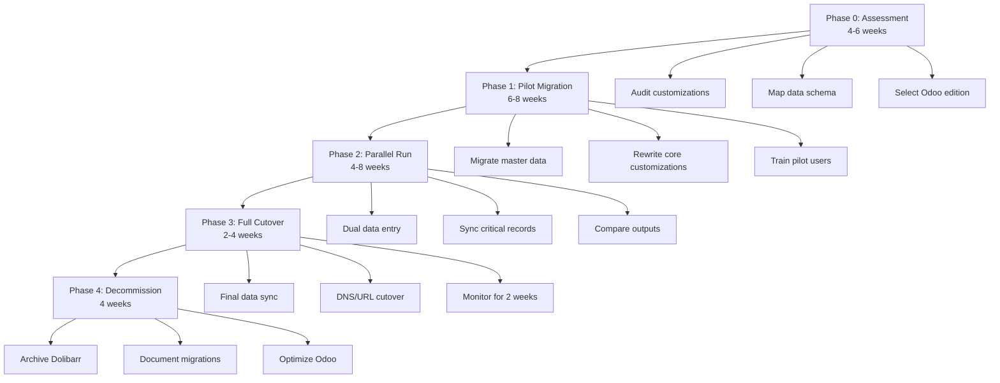

# Migrating from Dolibarr to Odoo: A Technical Guide


Migrating from [Dolibarr](https://github.com/Dolibarr/dolibarr) to [Odoo](https://github.com/odoo/odoo) represents a fundamental architectural shift—from a PHP-based modular ERP/CRM (7,473 GitHub stars, GPL-3.0 license) to a Python-driven integrated suite (53,442 stars, mixed licensing). Both are open-source business management platforms, but they differ in technical foundation, extensibility models, and operational philosophy. Dolibarr emphasizes lightweight deployment and selective module activation for small-to-medium businesses and freelancers, while Odoo offers a comprehensive, tightly integrated ecosystem with thousands of apps and a SaaS-first enterprise model.

This guide provides a structured migration framework for teams considering the transition. It covers suitability assessment, data inventory and mapping, compatibility risks across database engines (MySQL/PostgreSQL), API divergence between REST/SOAP (Dolibarr) and XML-RPC/JSON-RPC (Odoo), phased execution strategies, test protocols, and rollback gates. Organizations should approach migration as a multi-month technical project requiring stakeholder alignment, custom scripting, and iterative validation—not a simple data export-import operation.

---

## Table of Contents

- [When Migration Makes Sense (and When It Doesn't)](#when-migration-makes-sense-and-when-it-doesnt)
- [Core Technology Comparison](#core-technology-comparison)
- [Pre-Migration Assessment](#pre-migration-assessment)
- [Data Inventory and Compatibility Analysis](#data-inventory-and-compatibility-analysis)
- [Phased Migration Strategy](#phased-migration-strategy)
- [API and Integration Mapping](#api-and-integration-mapping)
- [Testing Strategy and Rollback Gates](#testing-strategy-and-rollback-gates)
- [Decision and Action Checklist](#decision-and-action-checklist)
- [Evidence, Assumptions, and Limitations](#evidence-assumptions-and-limitations)
- [Frequently Asked Questions](#frequently-asked-questions)
- [Sources](#sources)

---

## When Migration Makes Sense (and When It Doesn't)

### Justified Migration Scenarios

**Scale and Integration Requirements**  
Organizations outgrowing Dolibarr's modular architecture often migrate when they require deep integration across sales, manufacturing, HR, and accounting without custom glue code. Odoo's tightly coupled modules share a unified ORM (Object-Relational Mapping) layer, eliminating the need for extensive custom triggers or hooks that Dolibarr users must maintain.

**Advanced Manufacturing and MRP**  
While Dolibarr 23.0.3 (released May 2026) includes Bill of Materials (BOM) and Manufacturing Orders (MO), Odoo's manufacturing app provides multi-level BOMs, work center scheduling, quality control checkpoints, and maintenance management out-of-the-box. Teams running complex production workflows find Odoo's native capabilities reduce custom development.

**SaaS and Multi-Tenancy**  
Odoo.com's hosted offering and native multi-company support (via third-party modules in Dolibarr) appeal to organizations seeking centralized SaaS management or white-label solutions for clients. Odoo's enterprise edition includes official multi-database management absent in Dolibarr's standard distribution.

**Ecosystem and Marketplace**  
Odoo's app marketplace hosts thousands of commercial and community modules, compared to Dolibarr's ~1,000 extensions on DoliStore. Organizations requiring specialized verticals (e.g., hospitality PMS, healthcare) often find more mature Odoo apps.

### When to Stay with Dolibarr

**PHP Infrastructure Investment**  
Teams with deep PHP expertise, existing Laravel/Symfony integrations, or hosting environments optimized for PHP 7.2+ should weigh the cost of retraining and infrastructure overhaul. Dolibarr's codebase is designed for maintainability without heavy frameworks, making customization accessible to mid-level PHP developers.

**Licensing and Control**  
Dolibarr's GPL-3.0 license guarantees full source access and modification rights. Odoo uses a dual-license model: the Community Edition is LGPL-3.0, but the Enterprise Edition (required for features like Studio, rental management, and official support) uses a proprietary license. Organizations requiring fully open-source stacks face limitations.

**Simpler Deployment Models**  
Dolibarr supports lightweight deployments via DoliWamp (Windows), DoliDeb (Debian/Ubuntu), and Docker images requiring minimal configuration. Odoo's Python dependencies, database initialization, and module activation are more complex for small IT teams without DevOps experience.

**Cost Sensitivity**  
Dolibarr is entirely free for self-hosted deployments. Odoo Community Edition is free, but many production deployments migrate to Enterprise Edition to access studio customization tools, advanced reporting, and support—adding per-user licensing costs.

> [!WARNING]
> **Licensing Risk**: Odoo's Enterprise Edition features are not available in the Community Edition repository. Evaluate whether Community Edition modules meet your requirements before committing to migration, as retrofitting Enterprise features post-migration is not feasible.

---

## Core Technology Comparison

| Dimension | Dolibarr | Odoo |
|-----------|----------|------|
| **Language** | PHP 7.2+ with JavaScript | Python 3.8+ with JavaScript (Owl framework) |
| **Architecture** | Modular, optional components | Integrated suite, app dependencies |
| **Database** | MySQL, MariaDB, PostgreSQL | PostgreSQL (primary), limited MySQL support |
| **License** | GPL-3.0 (full stack) | Community: LGPL-3.0; Enterprise: Proprietary |
| **API** | REST, SOAP | XML-RPC, JSON-RPC |
| **ORM** | Custom SQL abstraction | Python ORM (model inheritance, computed fields) |
| **Extensibility** | Triggers, hooks, external modules | Inherited models, QWeb templates, server actions |
| **Deployment** | Apache/Nginx + PHP-FPM | Python WSGI (Gunicorn, uWSGI), Nginx reverse proxy |
| **GitHub Stars** | 7,473 (as of Aug 2026) | 53,442 (as of Aug 2026) |
| **GitHub Issues** | 1,104 open | 10,307 open |

*Data retrieved August 3, 2026*

### Architectural Implications

Dolibarr's PHP-based trigger system allows developers to intercept events (e.g., invoice validation) via simple hook files. Odoo's Python ORM requires subclassing models and overriding methods—more powerful for complex logic but steeper learning curve. Teams must rewrite all custom business logic during migration.

Odoo's PostgreSQL preference stems from its use of advanced features like array fields, JSONB columns, and full-text search. While MySQL support exists, many third-party Odoo modules assume PostgreSQL, creating compatibility risks.

> [!NOTE]
> **Inferred from repository structure**: Dolibarr's `htdocs/` directory contains flat PHP scripts with direct database queries, while Odoo's `addons/` directory uses MVC patterns with Python classes, XML views, and CSV data files. This structural difference impacts how quickly developers can locate and modify business logic.

---

## Pre-Migration Assessment

### Stakeholder Alignment

Before technical work begins, align business stakeholders on migration objectives:

- **Business Justification**: Document specific Dolibarr limitations driving migration (e.g., manufacturing constraints, integration costs).
- **Budget Allocation**: Account for license costs (if targeting Odoo Enterprise), developer time (rewriting customizations), infrastructure (Python hosting), and training.
- **Timeline Expectations**: Phased migrations typically span 3–6 months for organizations with moderate customization.

### Technical Inventory Audit

**Custom Code Audit**  
Inventory all custom modules, triggers, and hooks in Dolibarr's `htdocs/custom/` directory. Classify by:
- **Core Business Logic**: Must be rewritten in Python (highest priority).
- **UI Customizations**: May map to Odoo QWeb templates or Studio configurations.
- **Integrations**: Third-party connectors (payment gateways, shipping APIs) need re-evaluation.

**Module Usage Analysis**  
Query Dolibarr's `llx_const` table for enabled modules:

```sql
SELECT name, value FROM llx_const WHERE name LIKE 'MAIN_MODULE_%';
```

Map each enabled module to Odoo equivalents. Example:

| Dolibarr Module | Odoo Equivalent | Notes |
|-----------------|-----------------|-------|
| `MAIN_MODULE_FACTURE` (Invoicing) | `account` | Core module, data structure differs |
| `MAIN_MODULE_PROPAL` (Proposals) | `sale_management` | Odoo proposals require quotation templates |
| `MAIN_MODULE_STOCK` (Warehouse) | `stock` | Odoo uses different location hierarchy |
| `MAIN_MODULE_PROJET` (Projects) | `project` | Task dependencies unsupported in Dolibarr, native in Odoo |
| `MAIN_MODULE_RESOURCE` (HR) | `hr`, `hr_attendance` | Odoo has separate apps; no direct payroll equivalent |

**Third-Party Extensions**  
Review DoliStore purchases and evaluate Odoo marketplace alternatives. Budget for purchasing Odoo apps or custom development where gaps exist.


---

## Data Inventory and Compatibility Analysis

### Database Schema Mapping

Dolibarr and Odoo use fundamentally different schemas. Key differences:

**Primary Keys and Relationships**  
Dolibarr uses integer `rowid` as primary key with manual foreign key management. Odoo's ORM uses `id` with automatic relationship handling via `Many2one`, `One2many`, and `Many2many` fields.

**Core Entity Tables**

| Entity | Dolibarr Table | Odoo Model |
|--------|----------------|------------|
| Customers/Suppliers | `llx_societe` | `res.partner` (type field differentiates) |
| Contacts | `llx_socpeople` | `res.partner` (parent_id links to company) |
| Products | `llx_product` | `product.product`, `product.template` |
| Invoices | `llx_facture` | `account.move` (with `move_type='out_invoice'`) |
| Proposals | `llx_propal` | `sale.order` (state field indicates quote) |
| Stock Movements | `llx_stock_mouvement` | `stock.move`, `stock.move.line` |
| Projects | `llx_projet` | `project.project` |
| Tasks | `llx_projet_task` | `project.task` |

### Data Extraction Strategy

**Export via Dolibarr API**  
Dolibarr's [REST API](https://wiki.dolibarr.org/index.php/REST_API) (enabled via `MAIN_MODULE_API` constant) supports JSON exports:

```bash
curl -X GET "https://dolibarr.example.com/api/index.php/thirdparties" \
  -H "DOLAPIKEY: your_api_key"
```

Export entities in dependency order: partners → products → proposals → orders → invoices.

**Direct Database Export**  
For large datasets, use `mysqldump` or `pg_dump` with selective table exports, then write transformation scripts (Python recommended for Odoo compatibility).

### Data Transformation Challenges

**Multi-Currency Handling**  
Dolibarr stores currency per transaction in `llx_facture.fk_multicurrency`. Odoo requires currency setup in `res.currency` with exchange rates in `res.currency.rate` before importing transactions.

**VAT and Tax Codes**  
Dolibarr's `llx_c_tva` tax configuration uses percentage rates. Odoo's `account.tax` model requires tax computation type (`percent`, `fixed`, `division`), scope (sale/purchase), and account mappings. Country-specific features (Spanish IRPF, Canadian dual tax) need manual recreation.

**Document Attachments**  
Dolibarr stores files in `documents/{module}/{ref}/` with references in `llx_ecm_files`. Odoo uses `ir.attachment` model with filestore or database storage. Write migration script to:
1. Read file paths from `llx_ecm_files`.
2. Upload to Odoo via `/web/binary/upload_attachment` endpoint.
3. Link to corresponding `res.model` records.

> [!TIP]
> **Incremental Validation**: Migrate a single customer with their full transaction history (quotes, orders, invoices, payments) as a smoke test before bulk data migration. Verify totals, tax calculations, and attachment linkage.

---

## Phased Migration Strategy

### Recommended Phases



### Phase 1: Pilot Migration

**Objective**: Validate technical feasibility with a single business unit or product line.

1. **Environment Setup**: Deploy Odoo (Community or Enterprise) on staging infrastructure. Use Docker for rapid iteration:
   ```bash
   docker run -d -e POSTGRES_USER=odoo -e POSTGRES_PASSWORD=odoo \
     -e POSTGRES_DB=postgres --name db postgres:15
   docker run -p 8069:8069 --name odoo --link db:db -t odoo:19.0
   ```

2. **Master Data Migration**: Import charts of accounts, product catalog, and customer/supplier lists. Use Odoo's CSV import tool (`Settings > Technical > Import`) or write Python scripts using the ORM.

3. **Customization Rewrite**: Identify the top three business-critical customizations and rewrite in Python. Example: a Dolibarr hook that auto-applies discounts becomes an Odoo `sale.order` model override.

4. **User Acceptance Testing**: Train 5–10 pilot users on Odoo. Collect feedback on workflow differences (e.g., Odoo's unified chatter vs. Dolibarr's separate agenda module).

### Phase 2: Parallel Run

**Objective**: Operate both systems simultaneously to identify gaps and build confidence.

1. **Selective Dual Entry**: Enter new transactions (quotes, orders) in both systems. Compare outputs (invoice PDFs, inventory levels) daily.

2. **Integration Bridges**: Build temporary scripts to sync critical data (e.g., nightly customer updates from Dolibarr to Odoo) using both APIs.

3. **Performance Benchmarking**: Measure Odoo response times under production load. Odoo requires more RAM (2GB minimum per worker process) than Dolibarr.

### Phase 3: Full Cutover

**Objective**: Make Odoo the system of record.

1. **Final Data Sync**: Execute complete historical data migration (all closed invoices, archived projects). Verify record counts match source.

2. **DNS and URL Updates**: Redirect internal bookmarks and third-party integrations to Odoo endpoints.

3. **Hypercare Period**: Provide 24/7 support for two weeks post-cutover. Monitor Odoo logs (`/var/log/odoo/odoo-server.log`) for errors.

### Phase 4: Decommission

Maintain read-only Dolibarr instance for six months for audit/reference purposes. Export final database dump and store securely.

---

## API and Integration Mapping

### API Protocol Differences

Dolibarr exposes REST and SOAP APIs. Odoo uses XML-RPC (legacy) and JSON-RPC (modern). Update all integrations:

**Authentication**  
Dolibarr uses API keys (`DOLAPIKEY` header). Odoo requires session-based authentication:

```python
import xmlrpc.client

url = 'https://odoo.example.com'
db = 'production'
username = 'admin'
password = 'admin'

common = xmlrpc.client.ServerProxy(f'{url}/xmlrpc/2/common')
uid = common.authenticate(db, username, password, {})

models = xmlrpc.client.ServerProxy(f'{url}/xmlrpc/2/object')
partners = models.execute_kw(db, uid, password, 
    'res.partner', 'search_read', 
    [[['is_company', '=', True]]], 
    {'fields': ['name', 'email'], 'limit': 5})
```

**Webhook Replacement**  
Dolibarr triggers can call external webhooks. Odoo requires server actions or custom controllers. Example: rewrite a "send Slack message on order validation" trigger as an Odoo automated action.

### Third-Party Service Updates

| Service Type | Dolibarr Module | Odoo Module | Migration Notes |
|--------------|-----------------|-------------|------------------|
| Payment Gateway | `paypal`, `stripe` | `payment_paypal`, `payment_stripe` | Re-enter API credentials; test in sandbox |
| Shipping | Custom integrations via triggers | `delivery_*` apps (FedEx, UPS, DHL) | Evaluate official Odoo connectors vs. custom |
| Accounting Export | CSV exports to Sage, QuickBooks | `account_*` connector modules | Odoo has native integrations for many GL systems |
| Email Marketing | `mailing` module (basic) | `mass_mailing` (Community), `marketing_automation` (Enterprise) | Odoo offers advanced segmentation |

> [!NOTE]
> **API Rate Limits**: Odoo.com SaaS enforces API rate limits (600 requests/5 minutes for Enterprise). Self-hosted installations have no limits but require performance tuning for high-volume API usage.

---

## Testing Strategy and Rollback Gates

### Validation Framework

**Data Integrity Tests**  
After each migration phase, run SQL queries comparing record counts:

```sql
-- Dolibarr: Count customers
SELECT COUNT(*) FROM llx_societe WHERE client IN (1,3);

-- Odoo: Count customers
SELECT COUNT(*) FROM res_partner WHERE customer_rank > 0;
```

Verify financial totals match:

```sql
-- Dolibarr: Total invoiced revenue (2025)
SELECT SUM(total_ttc) FROM llx_facture 
WHERE YEAR(datef) = 2025 AND fk_statut IN (1,2);

-- Odoo: Total invoiced revenue (2025)
SELECT SUM(amount_total) FROM account_move 
WHERE EXTRACT(YEAR FROM invoice_date) = 2025 
  AND move_type = 'out_invoice' 
  AND state = 'posted';
```

**Functional Test Cases**  
| Test Scenario | Pass Criteria | Rollback Trigger |
|---------------|---------------|------------------|
| Create customer quote | PDF matches Dolibarr format, pricing correct | Discounts not applied |
| Confirm sales order | Inventory reserved, delivery order generated | Stock not decremented |
| Generate invoice | Tax calculation matches, payment terms correct | Wrong VAT rate |
| Record payment | Reconciliation automatic, bank statement imports | Manual reconciliation required |
| Manufacture product | BOM explosion correct, work orders created | Component allocation fails |

**Performance Baselines**  
Measure before migration:
- Dolibarr: Time to load 1,000-line product list, generate 100-page invoice PDF.
- After migration: Same operations in Odoo. Acceptable performance degradation: <20%.

### Rollback Decision Gates

Define go/no-go criteria at each phase:

**Phase 1 Gate**: 
- [ ] 95% of pilot transactions processed without errors.
- [ ] Core customizations function equivalently to Dolibarr.
- [ ] Pilot users rate Odoo usability ≥7/10.

**Phase 2 Gate**:
- [ ] Zero critical bugs (data loss, incorrect financials) in parallel run.
- [ ] Integration partners (payment gateways, shipping) tested successfully.
- [ ] Training complete for 80% of end users.

**Phase 3 Gate**:
- [ ] Final data migration variance <0.1% for financial records.
- [ ] IT team comfortable with Odoo administration and troubleshooting.
- [ ] Executive sponsor approves cutover.

**Rollback Procedure**  
If critical issues emerge post-cutover:
1. Restore Dolibarr database from pre-migration backup.
2. Update DNS to revert to Dolibarr URLs.
3. Communicate rollback to users within 2 hours.
4. Preserve Odoo environment for post-mortem analysis.

> [!WARNING]
> **Point of No Return**: Once customers receive Odoo-generated invoices with new numbering sequences, rollback becomes impractical due to regulatory compliance (invoice number continuity). Plan cutover during low-volume periods (e.g., month-end).

---

## Decision and Action Checklist

### Pre-Migration Decisions

- [ ] **Odoo Edition Selected**: Community vs. Enterprise (evaluate Studio, rental, support needs).
- [ ] **Hosting Model**: Self-hosted vs. Odoo.com SaaS vs. partner-hosted.
- [ ] **Database Engine**: PostgreSQL confirmed (required for full feature support).
- [ ] **Budget Approved**: Include licenses, developer time, infrastructure, training.
- [ ] **Custom Code Inventory**: List of all Dolibarr modules, triggers, hooks with rewrite estimates.
- [ ] **Data Retention Policy**: Historical data to migrate (e.g., last 3 years vs. full history).

### Execution Checklist

- [ ] **Staging Environment**: Odoo instance deployed with production-equivalent data.
- [ ] **Schema Mapping Document**: Excel/CSV mapping every Dolibarr table to Odoo model.
- [ ] **Migration Scripts**: Python scripts for data transformation and import.
- [ ] **Integration Rewrites**: All API consumers updated to Odoo endpoints.
- [ ] **User Training**: Workshops conducted, documentation published.
- [ ] **Performance Tested**: Load testing confirms Odoo handles peak transaction volume.
- [ ] **Backup Strategy**: Automated daily backups configured for Odoo database and filestore.
- [ ] **Monitoring Tools**: Sentry/New Relic integrated for error tracking.
- [ ] **Rollback Plan**: Documented procedure with responsible parties assigned.
- [ ] **Cutover Communication**: Email, Slack, intranet announcements scheduled.

### Post-Migration Validation

- [ ] **Data Reconciliation**: Financial totals, inventory counts, customer balances match.
- [ ] **Month-End Close**: First month-end successfully closed in Odoo.
- [ ] **Regulatory Compliance**: VAT returns, tax filings processed correctly.
- [ ] **User Satisfaction Survey**: Collect feedback from all user groups.
- [ ] **Performance Optimization**: Database indexes, caching, worker tuning completed.
- [ ] **Dolibarr Decommission**: Read-only archive established, production instance shut down.

---

## Evidence, Assumptions, and Limitations

### Evidence Base

This guide synthesizes information from:
- **Dolibarr GitHub repository** ([Dolibarr/dolibarr](https://github.com/Dolibarr/dolibarr)): 7,473 stars, GPL-3.0 license, PHP codebase, 1,104 open issues as of August 3, 2026.
- **Odoo GitHub repository** ([odoo/odoo](https://github.com/odoo/odoo)): 53,442 stars, LGPL-3.0 (Community), Python codebase, 10,307 open issues as of August 3, 2026.
- **Dolibarr 23.0.3 release notes** ([May 17, 2026](https://github.com/Dolibarr/dolibarr/releases/tag/23.0.3)): Security fixes, PostgreSQL compatibility improvements, BOM/MO feature enhancements.
- **Repository README files**: Feature lists, installation procedures, system requirements.

### Architectural Inferences

The following conclusions are inferred from repository structure and documentation:
- **Dolibarr's modular design**: Based on `htdocs/` directory containing independent module folders with direct database access patterns.
- **Odoo's ORM-centric approach**: Inferred from `addons/` structure with Python model files, XML view definitions, and no raw SQL in standard modules.
- **Deployment complexity**: Dolibarr's single `install.php` script vs. Odoo's multi-step database initialization, module installation, and asset compilation suggests higher operational overhead for Odoo.

### Limitations and Gaps

**No Benchmark Data Available**  
This guide does not provide performance benchmarks (transaction throughput, concurrent user limits) for either platform, as no such data was supplied. Organizations should conduct their own load testing.

**Version-Specific Guidance**  
Migration procedures may vary between Odoo versions (Community vs. Enterprise, v16 vs. v19). This guide assumes Odoo 19.0 (default branch as of August 2026).

**Custom Module Compatibility**  
Third-party Dolibarr modules from DoliStore or custom-built extensions may have no Odoo equivalent. Functionality gaps require case-by-case evaluation.

**Licensing Clarifications**  
Odoo's repository shows "NOASSERTION" license metadata, but official documentation confirms LGPL-3.0 for Community Edition. Enterprise Edition licensing requires direct contact with Odoo S.A.

### GitHub Metrics Interpretation

GitHub stars (Dolibarr: 7,473; Odoo: 53,442) indicate developer interest and ecosystem size, not production usage rates or software quality. The higher open issue count in Odoo (10,307 vs. 1,104) reflects larger user base and active development, not defect density.

---

## Frequently Asked Questions

### Can I migrate from Dolibarr Community to Odoo Enterprise directly?

Yes, but evaluate Community Edition first. Odoo Enterprise requires per-user licensing, and many features (Studio, IoT, rental management) are Enterprise-only. Migrate to Community Edition initially, then upgrade to Enterprise if needed—this avoids vendor lock-in during the trial period.

### How long does a typical migration take?

For organizations with moderate customization (5–10 custom modules, 10,000–50,000 transactions), expect 4–6 months: 6–8 weeks for pilot, 6–8 weeks parallel run, 2–4 weeks cutover, 4 weeks stabilization. Highly customized Dolibarr instances may require 9–12 months.

### What happens to Dolibarr-specific features like NPR VAT or Spanish IRPF?

Odoo supports most country-specific tax rules via localization modules (`l10n_fr`, `l10n_es`). However, configurations differ. French DOM-TOM NPR VAT requires manual tax setup in `account.tax`. Spanish IRPF maps to withholding tax configurations. Test thoroughly with your accounting team.

### Can I run Odoo on MySQL instead of PostgreSQL?

Odoo's codebase includes MySQL compatibility layers, but PostgreSQL is strongly recommended. Many third-party modules and Odoo Enterprise features assume PostgreSQL-specific functions (JSONB, array aggregates). Migrating from Dolibarr's MySQL database to Odoo PostgreSQL is safer than attempting MySQL-to-MySQL.

### How do I handle multi-currency historical data?

Export Dolibarr's currency exchange rates from `llx_multicurrency` and import to Odoo's `res.currency.rate` before migrating transactions. Odoo recalculates reporting currency amounts using configured rates, so ensure rate history is complete to avoid financial discrepancies.

### What if critical Dolibarr customizations have no Odoo equivalent?

Three options: (1) Rewrite as custom Odoo module using Python ORM and QWeb templates; (2) Find third-party Odoo app on the marketplace; (3) Reconsider migration if customization is core to business operations. Budget 40–80 developer hours per complex customization for rewrite.

### Is training required for users switching from Dolibarr to Odoo?

Yes. Despite both being web-based ERP systems, workflows differ significantly. Odoo's "chatter" (unified activity feed), kanban views, and app-switching model require 4–8 hours of training per user role. Budget for workshops, video tutorials, and sandbox environments.

---

## Sources

- [Dolibarr canonical repository](https://github.com/Dolibarr/dolibarr)
- [Dolibarr latest GitHub release](https://github.com/Dolibarr/dolibarr/releases/tag/23.0.3)
- [Odoo canonical repository](https://github.com/odoo/odoo)
