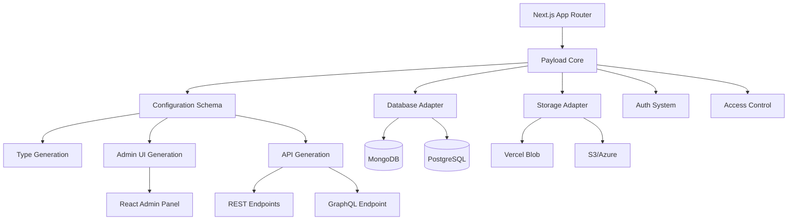

# Payload CMS: Next.js Native Headless CMS Repository Review

Payload CMS positions itself as a Next.js native headless CMS that installs directly into your `/app` folder, merging backend infrastructure with frontend application code. With 43,942 GitHub stars as of August 2026, the MIT-licensed [payloadcms/payload repository](https://github.com/payloadcms/payload) targets developers building content-driven applications who want full control over their stack without vendor lock-in. The project claims to offer "instant backend superpowers" by combining a TypeScript-first data layer, auto-generated admin UI, and both REST and GraphQL APIs.

This repository review examines Payload's technical architecture, maintenance signals, intended user profile, and adoption considerations. We analyze the codebase structure inferred from repository topics and documentation, assess health metrics including the 948 open issues visible as of data retrieval on August 3, 2026, and outline a responsible evaluation path for teams considering Payload against alternative headless CMS or full-stack frameworks.

## Table of Contents

- [Repository Overview and Purpose](#repository-overview-and-purpose)
- [Architecture and Technical Design](#architecture-and-technical-design)
- [Maintenance Signals and Repository Health](#maintenance-signals-and-repository-health)
- [Intended Users and Use Cases](#intended-users-and-use-cases)
- [Evidence-Backed Strengths](#evidence-backed-strengths)
- [Known Limitations and Considerations](#known-limitations-and-considerations)
- [Decision Checklist](#decision-checklist)
- [Evidence, Assumptions, and Limitations](#evidence-assumptions-and-limitations)
- [Frequently Asked Questions](#frequently-asked-questions)
- [Sources](#sources)

## Repository Overview and Purpose

The [payloadcms/payload repository](https://github.com/payloadcms/payload) hosts a full-stack TypeScript framework that combines a headless CMS with Next.js application infrastructure. Created on January 5, 2021, the project has grown to 43,942 stars and 3,992 forks, indicating substantial community interest. The repository delivers:

- **Integrated backend framework**: Authentication, authorization, database abstraction, and API generation within a Next.js application structure
- **Auto-generated admin UI**: React-based content management interface built from configuration schemas
- **Database flexibility**: Support for MongoDB and PostgreSQL via adapter architecture
- **Dual API surface**: Both REST and GraphQL endpoints generated from collection definitions
- **TypeScript code generation**: Automatic type definitions derived from configuration

The repository includes templates for common deployment patterns (website, e-commerce), official storage adapters (Vercel Blob, Azure, S3), and plugin infrastructure for extending functionality. The [latest release v3.87.0](https://github.com/payloadcms/payload/releases/tag/v3.87.0) was published July 31, 2026, with commits pushed as recently as August 3, 2026.

> [!NOTE]
> Payload CMS is licensed under MIT, permitting commercial use without licensing fees. However, the project is sponsored by Payload CMS Inc., which offers Payload Cloud—a managed hosting service separate from the open-source framework.

### Repository Structure

Based on repository topics and documentation, the project appears organized as a monorepo containing:

- Core payload package
- Database adapters (`@payloadcms/db-mongodb`, `@payloadcms/db-postgres`)
- Storage plugins (`@payloadcms/storage-vercel-blob`, `@payloadcms/storage-azure`)
- Rich text editor integration (`@payloadcms/richtext-lexical`)
- Official templates and examples
- Admin UI components

This architecture inferred from repository metadata suggests a modular design where teams select database, storage, and feature plugins during initialization.

## Architecture and Technical Design

### Core Technical Characteristics

| Aspect | Implementation |
|--------|----------------|
| **Runtime** | Node.js, Next.js App Router |
| **Language** | TypeScript (primary), JavaScript |
| **Database** | MongoDB or PostgreSQL via adapters |
| **API Protocols** | REST, GraphQL |
| **Frontend Framework** | React (admin UI), framework-agnostic headless API |
| **Authentication** | Built-in with JWT/HTTP-only cookies |
| **File Storage** | Pluggable (Vercel Blob, S3, Azure, local filesystem) |

The architecture centers on a configuration-driven model where developers define collections and globals in TypeScript. From these definitions, Payload generates:

1. **TypeScript interfaces** for documents, API responses, and frontend queries
2. **Database schemas** translated through the selected adapter
3. **API routes** registered in Next.js with validation middleware
4. **Admin UI components** for content editing, including field types, conditional logic, and access control

### Integration with Next.js

Payload's Next.js native design means the CMS runs within your application's server runtime rather than as a separate service. According to repository documentation, this allows:

- Querying the database directly in React Server Components without API calls
- Sharing authentication state between CMS admin and frontend
- Deploying the entire stack (frontend + backend + admin) to serverless platforms like Vercel or Cloudflare Workers
- Extending admin UI with custom React components that import from your app codebase

This tight coupling differs from traditional headless CMS architectures where the content management system runs as an independent service accessed via network API.

> [!TIP]
> The "website" template (`pnpx create-payload-app@latest -t website`) demonstrates production patterns including custom rich text blocks, on-demand revalidation, and live preview, making it a stronger starting point than the default template for evaluating real-world architecture.

## Maintenance Signals and Repository Health

### Activity Metrics (as of August 3, 2026)

| Metric | Value | Context |
|--------|-------|----------|
| **Open Issues** | 948 | Not a defect count; includes feature requests, questions, and discussions |
| **Contributors** | Not specified in data | README shows contributor badge |
| **Last Commit** | August 3, 2026 (7:48 AM UTC) | Active development |
| **Release Cadence** | v3.87.0 on July 31, 2026 | Version 3.x series active |
| **Forks** | 3,992 | Indicates community experimentation and potential contributions |
| **Watchers** | 153 | Ongoing monitoring by interested developers |

The repository demonstrates continuous maintenance with daily commit activity. The [v3.87.0 release notes](https://github.com/payloadcms/payload/releases/tag/v3.87.0) document 14 bug fixes, 1 feature addition, and multiple test/documentation improvements, suggesting an established release process.

### Open Issue Volume

The 948 open issues represent a mix of bug reports, feature requests, and support questions. For a framework of this scope with 43.9k stars, this volume suggests:

- **High engagement**: Active user base reporting issues and requesting features
- **Potential backlog**: May indicate faster feature requests than maintainer capacity to close issues
- **Support load**: Some issues appear to be usage questions rather than defects

Without access to issue labels and closure rates, we cannot determine the percentage representing critical bugs versus enhancement requests.

> [!WARNING]
> The high open issue count warrants investigation before adoption. Review recent issues in categories relevant to your use case (database adapter, storage provider, specific field types) to assess resolution speed and maintainer responsiveness.

### Migration Context

The README references a "3.0 Migration Guide," indicating a major version transition. The latest release (3.87.0) suggests the v3 series is mature with incremental improvements. Teams should verify:

- Whether v2 receives security patches
- Breaking change policies between minor versions in v3.x
- Plugin compatibility across versions

## Intended Users and Use Cases

Payload targets technical teams comfortable with TypeScript and Next.js who want:

### Primary User Profile

- **Full-stack developers** building content-driven applications (marketing sites, blogs, e-commerce) with Next.js
- **Engineering teams** requiring granular access control, version control, and audit trails for content
- **Product builders** who need both headless CMS capabilities and application backend features (custom business logic, authentication) in one framework
- **Organizations** prioritizing self-hosting and avoiding SaaS vendor lock-in

### Anti-Patterns

Payload may not fit teams needing:

- **Non-technical content editors only**: The admin UI assumes technical comfort; no-code builders like Webflow or WordPress with page builders offer simpler interfaces
- **Decoupled architecture**: Payload's Next.js integration couples CMS and frontend; teams wanting complete separation should evaluate standalone headless CMS services
- **Non-JavaScript stacks**: While Payload exposes REST/GraphQL APIs consumable from any client, running the backend requires Node.js infrastructure
- **Plug-and-play simplicity**: Configuration-driven architecture requires TypeScript proficiency and understanding of backend concepts

### Ideal Use Cases

Based on repository features and templates:

1. **Marketing websites** with complex content structures, multilingual support, and preview/draft workflows
2. **E-commerce platforms** needing custom product logic, inventory management, and order processing alongside content
3. **SaaS applications** requiring admin panels for user-generated content with per-tenant access control
4. **Internal tools** combining CMS capabilities with custom business logic in a unified codebase

## Evidence-Backed Strengths

These strengths derive from repository documentation, code structure, and feature lists verified against the README:

### 1. TypeScript-First Design

Payload generates TypeScript types from configuration schemas, providing compile-time safety for:

- Database queries and mutations
- API request/response shapes
- Admin UI field values
- Access control function signatures

This reduces runtime errors and improves developer experience in IDEs with autocomplete and type checking.

### 2. Fine-Grained Access Control

The framework supports field-level, document-level, and operation-level access control functions with full TypeScript context. This enables:

- Row-level security policies
- Conditional field visibility based on user roles
- Dynamic permission checks using database queries

### 3. Extensibility Architecture

Multiple extension points documented:

- **Custom field types**: Build reusable form inputs with server-side validation
- **Hooks**: Intercept operations (beforeChange, afterRead) for side effects
- **Admin UI components**: Replace or extend default interfaces with custom React components
- **Plugins**: Package reusable configuration as npm modules

The plugin ecosystem (discoverable via `payload-plugin` GitHub topic) demonstrates community extensions for SEO, redirects, and third-party integrations.

### 4. Deployment Flexibility

Official one-click deployment templates for:

- **Vercel**: Next.js frontend + Neon PostgreSQL + Vercel Blob storage
- **Cloudflare**: Workers + D1 database + R2 storage

The MIT license permits self-hosting on any Node.js-compatible platform without license restrictions.

### 5. Lexical Rich Text Editor

Integration with Meta's Lexical editor provides:

- Block-based content editing
- Custom block types (callouts, embeds, code blocks)
- Serialization to JSON for storage and HTML for rendering
- Extensible plugin architecture for editor features

## Known Limitations and Considerations

### 1. Next.js Dependency

Payload's architecture tightly couples with Next.js App Router. This means:

- **Framework lock-in**: Migrating to other frameworks (Remix, SvelteKit, Astro) requires architectural changes
- **Version constraints**: Must maintain compatibility with supported Next.js versions
- **Learning curve**: Teams unfamiliar with Next.js server components must learn both frameworks

### 2. Database Adapter Maturity

While PostgreSQL and MongoDB adapters exist, feature parity and performance characteristics may differ:

- Check adapter-specific issues for known limitations
- Verify transaction support for operations requiring atomicity
- Test performance at expected data volumes, especially for complex queries with joins

### 3. Serverless Constraints

When deploying to serverless platforms:

- **Cold start latency**: Initial requests may be slow as functions initialize
- **Execution timeouts**: Long-running operations (bulk imports, complex migrations) may exceed platform limits
- **Connection pooling**: Database connection management requires careful configuration

### 4. Migration and Upgrade Path

The v2 to v3 migration guide indicates breaking changes between major versions. Teams should:

- Budget time for version upgrades
- Test plugin compatibility after updates
- Maintain awareness of deprecation notices in release notes

### 5. Documentation Completeness

While the repository links to [official documentation](https://payloadcms.com/docs/getting-started/what-is-payload), some advanced patterns may require examining:

- Example repositories
- GitHub discussions
- Source code comments

Community plugin documentation quality varies.

> [!NOTE]
> The 948 open issues as of August 2026 may include documentation gaps reported by users. Review issues tagged with "documentation" or "question" to identify common confusion points.

## Decision Checklist

Use this checklist to evaluate Payload CMS for your project:

### Technical Fit

- [ ] **Next.js commitment**: Is your team building with Next.js or willing to adopt it?
- [ ] **TypeScript proficiency**: Do developers have experience with TypeScript and type-driven development?
- [ ] **Database selection**: Do supported adapters (MongoDB, PostgreSQL) meet your data modeling needs?
- [ ] **Infrastructure control**: Do you need/want to manage hosting, or prefer managed services?
- [ ] **Serverless compatibility**: If deploying serverless, have you tested cold start performance and execution limits?

### Feature Requirements

- [ ] **Content modeling**: Can Payload's field types (blocks, relationships, conditional logic) represent your content structure?
- [ ] **Access control**: Do you need field-level, document-level, or operation-level permission rules?
- [ ] **Localization**: Does your project require multi-language content?
- [ ] **Versioning**: Do you need draft/publish workflows and content version history?
- [ ] **Media handling**: Do supported storage adapters meet your file upload requirements?

### Adoption Risk Assessment

- [ ] **Issue investigation**: Have you reviewed open issues for critical bugs in features you'll use?
- [ ] **Plugin ecosystem**: Are required plugins actively maintained or will you build custom functionality?
- [ ] **Migration path**: Do you have a plan for major version upgrades and potential breaking changes?
- [ ] **Team capacity**: Can your team debug framework internals if encountering edge cases?
- [ ] **Vendor relationship**: Are you comfortable with MIT-licensed OSS backed by a commercial entity (Payload CMS Inc.)?

### Evaluation Process

1. **Deploy website template**: Run `pnpx create-payload-app@latest -t website` and evaluate admin UI, content modeling, and API patterns
2. **Model your content**: Define 2-3 representative collections with relationships, conditional fields, and access control
3. **Test integrations**: Verify database adapter, storage provider, and any required plugins work together
4. **Performance benchmark**: Load test API endpoints and admin UI with realistic data volumes
5. **Review community**: Join Discord, scan GitHub discussions for common pain points and maintainer responsiveness

## Evidence, Assumptions, and Limitations

### Evidence Sources

This review relies on:

- [Payload CMS GitHub repository](https://github.com/payloadcms/payload) metadata, README, and topics
- [Release notes for v3.87.0](https://github.com/payloadcms/payload/releases/tag/v3.87.0)
- Repository statistics retrieved August 3, 2026

We did not analyze:

- Source code implementation details
- Performance benchmarks or comparative measurements
- User adoption metrics or production deployment statistics
- Security audit results

### Architectural Inferences

The following architectural conclusions are inferred from repository documentation and may not reflect actual implementation:

- Monorepo structure containing core package and adapters
- Configuration-driven type generation workflow
- Plugin architecture details
- Database adapter feature parity

Teams should verify these details by examining source code or consulting official documentation.

### GitHub Metrics Context

- **43,942 stars**: Indicates community interest and awareness, not production usage or market share
- **948 open issues**: Includes feature requests, questions, and discussions—not exclusively defects
- **3,992 forks**: Suggests experimentation and contribution activity, not deployment count

These metrics provide maintenance signals but should not substitute for direct technical evaluation.

### Data Freshness

All repository metrics reflect state as of August 3, 2026. For current statistics, consult the [live repository](https://github.com/payloadcms/payload).

## Frequently Asked Questions

### What is Payload CMS designed for?

Payload CMS is a Next.js native headless CMS framework that combines content management, authentication, and database abstraction in a TypeScript application. It targets developers building content-driven websites, e-commerce platforms, or SaaS applications who want full-stack control without SaaS vendor lock-in.

### How does Payload differ from traditional headless CMS platforms?

Unlike standalone services (Contentful, Sanity), Payload runs within your Next.js application rather than as a separate service. This allows direct database queries in React Server Components, shared authentication, and single-codebase deployment, but tightly couples your application to Next.js architecture.

### What databases does Payload support?

Official adapters exist for MongoDB and PostgreSQL. Database selection affects query capabilities, transaction support, and deployment infrastructure. Teams should verify adapter maturity and feature parity for their use case.

### Can I use Payload without Next.js?

Payload's architecture is designed for Next.js App Router integration. While it exposes REST and GraphQL APIs consumable from any client, running the backend requires a Next.js server environment. Teams wanting framework-agnostic backends should evaluate alternative headless CMS solutions.

### Is Payload CMS free?

The open-source framework is MIT-licensed with no usage fees. Payload CMS Inc. offers Payload Cloud—a managed hosting service—as a commercial product separate from the OSS project. Self-hosting incurs only infrastructure costs.

### How actively is Payload maintained?

The repository shows daily commit activity with the most recent push on August 3, 2026. Release v3.87.0 published July 31, 2026, included 14 bug fixes and documentation updates. However, 948 open issues suggest high engagement volume that may affect support responsiveness.

### What is the migration path between major versions?

Payload has published a v2 to v3 migration guide indicating breaking changes between major versions. Teams should budget time for upgrades, test plugin compatibility, and monitor deprecation notices in release notes. The current v3.87.0 release suggests the v3 series is stable with incremental updates.

## Sources

- [Payload CMS canonical repository](https://github.com/payloadcms/payload)
- [Payload CMS latest GitHub release](https://github.com/payloadcms/payload/releases/tag/v3.87.0)
